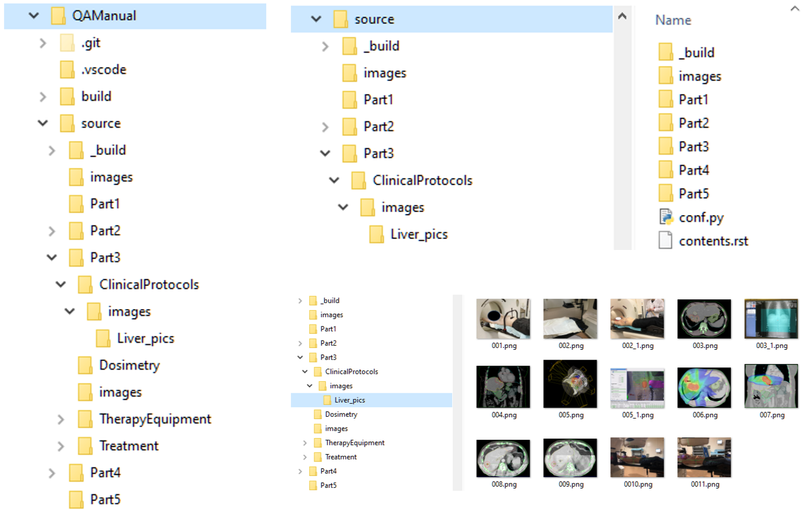

.. _edit_manual:

Редактирование руководства
==========================

Данное приложение содержит описание разворачивание средств разработки руководства, 
правил работы с ними и некоторых других технических вопросов, не связанных непосредственно с системой качества.

Руководство создается в платформенно независимой среде. 
Основной рабочей версией является электронный справочник, отображаемой в Web браузере. 
Параллельно генерируется PDF версия руководства, в котором сохраняются все гиперссылки.
Рабочую среду работы над документами можно разворачивать одинаково на Windows, MAC и Unix.

Руководство пишется на основе современных технологий.
Ключевыми являются написание документов ня языке разметки
`reStructuredText <https://en.wikipedia.org/wiki/ReStructuredText>`_.
Генерация готовых документов осуществляется набором инструментов
`Sphinx <https://www.sphinx-doc.org/en/master/index.html>`_.

Разворачивание полной среды разработки документации может быть сложным для тех, 
кто непосредственно занимается контентом.
Но для большинства авторов это не является необходимым или важным.
Для написания контента автору необходимо иметь минимум:

#. Установленную систему **Sphinx** (нужно для Preview)
#. Установленную программу **Visual Studio Code**
#. Установленное для него расширение **reStructuredText**
#. Налаженную инфраструктуру для работы с **GitHub** 
   где находится первоисточник документации

Далее будут кратко описаны действия по установке и использованию перечисленного.

Публикация рабочих версий, пригодных для клинического использования,
осуществляется администратором руководства.

Работа с системой контроля версий GitHub
~~~~~~~~~~~~~~~~~~~~~~~~~~~~~~~~~~~~~~~~

#. Для начала работы необходимо зарегистрироваться в системе по адресу:

      http://github.com

#. Переслать администратору ваше имя (login) в системе для предоставления доступа к 
   репозиторию руководства. E-mail администратора:

      ggorlachev@roiss.ru

#. Установить на своем компьютере систему Git, если это еще не сделано, например, 
   во время работы над другими проектами. Руководство по установке и описание работы 
   с ситемами контроля версий включая прекрасный учебник можно найти по адресу
   ::

      https://git-scm.com/book/en/v2/Getting-Started-Installing-Git

#. Первый раз клонировать проект на собственный компьютер и далее взаимодействовать 
   с центральным ресурсом через редактор **VSCode**. Для клонирования создайте папку проекта, 
   перейдите в нее и выполните команду клонирования:

   .. code-block:: none

      mkdir projects
      cd projects
      cd QAManual
      code . 

#. Дополнительно можно установить приложение для работы с системой GitHub. 
   Описание, адрес загрузки и прочая информация находятся по адресу
   ::

      https://desktop.github.com

   GitHub работает с этим приложением через команду **Open in Desktop**. 
   Изучение этой программы может потребовать усилий и рекомендуется только для тех, кто будет много работать с 
   данной системой включая разработки помимо документации. 
   Перейти на сайт проекта и создать локальную копию
   ::

      https://github.com/ggorlachev/QAManual

   Далее **Clone or download** -> **Open in Desktop** -> **Удобная вам корневая папка проектов**.
   GitHub является самым известным в мире сервисом контроля версий. 
   Он используется в первую очередь разработчиками программного обеспечения. 
   Данный проект - пример - более широкого смысла применения методики контроля версий. 
   Более подробная информация содержится на сайте сервиса и интернете и выходит за рамки данного документа.
   Создание веток документов и отправка изменений на сервер частично будут рассмотрены далее в разделе, 
   касающемся непосредственно редактирования документов. 
   Описанная в данном пункте процедура является альтернативной клонированию, описанному в предыдущем пункте.

Редактирование документов с помощью Visual Studio Code (VSCode)
~~~~~~~~~~~~~~~~~~~~~~~~~~~~~~~~~~~~~~~~~~~~~~~~~~~~~~~~~~~~~~~

Существует множество способов редактирования документов от простого **Notepad** до специализированных редакторов, 
работающих с языком разметки **Markdown**. Хорошим путем является редактирование в среде разработки **VSCode**.
Важным соображением при выборе редактора является взаимодействие с **GitHub**. 
На данном этапе рекомендуется работа с документами исключительно с помощью **VSCode**, 
в котором связь с системой контроля версий интегрирована.

Загрузки и справочная информация по VSCode находится по адресу::

   https://code.visualstudio.com/download

Для редактирования документов перейдите в папку проекта и запустите **VSCode**
::

   cd QAManual
   code .

**VSCode** - это расширяемая среда. Для эффективной работы с **Markdown** 
документы могут быть полезны плагины. 
Система по умолчанию предлагает установить рекомендуемые плагины 
в зависимости от формата файлов. Выбор плагинов пока 
не регламентируется и допускается собственный выбор.

VSCode имеет множество других применений. 
Его следует рассматривать как основной инструмент медицинских 
физиков и уделить освоению работы с ним столько сколько нужно. 
Вся учебная информация в интернете начиная с сайта самого продукта.

Расширение **reStructuredText**
-------------------------------

Данное `расширение для работы с руководством в Sphinx <https://docs.restructuredtext.net/>`_
является полезным и даже необходимым.

Оно подчеркивает синтаксис в исходном тексте, содержит шаблоны кодов,
подсказки и показывает отформатированный текст прямо в работе над документами.

Установка расширение просто и очевидно. 
Смотри `инструкцию производителя <https://marketplace.visualstudio.com/items?itemName=lextudio.restructuredtext>`_.

Установка всего требуемого для данного расширения в норме не требуется, 
так как должно было быть установлено при разворачивании платформы *Sphinx*.

Для работы по написанию контнта из всей документации расширения достаточно познакомиться с 
`Keyboard Shortcuts <https://docs.restructuredtext.net/articles/shortcuts.html>`_ и 
`Code Snippets <https://docs.restructuredtext.net/articles/snippets.html>`_.

Язык разметки **reStructuredText**
~~~~~~~~~~~~~~~~~~~~~~~~~~~~~~~~~~

**reStructuredText** - это очень простой набор правил меток внутри обычного текстового файла, 
указывающий тип прилежащей информации с точки зрения форматирования конечного результата.

Самый простой способ изучения языка - это смотреть в исходный текст 
данного документа и действовать по аналогии. 
В качестве справочника можно использовать данное приложение.
В части собственно написания контента примеры как сделать то или это
находятся в разделе `Вопросы и ответы`_ данного приложения.

И, наконец, для работы с контентом рекомендуется
`шпаргалка по форматированию <https://thomas-cokelaer.info/tutorials/sphinx/rest_syntax.html#internal-and-external-links>`_.

Генерация документов в среде **Sphinx**
~~~~~~~~~~~~~~~~~~~~~~~~~~~~~~~~~~~~~~~

**Sphinx** - это по сути технология и набор инструментов для разработки документации. 
Под разработкой имеется ввиду создание контента документации со служебными метками
используемыми для генерации документов в пригодном для употребления человеком.
Это как минимум **Web** сайт документации и документов формате **PDF**.

Установка **Sphinx** начинается с установки **Python** (если еще не установлен).
Домашняя страница **Python** с установочными пакетами и документацией находится по ссылке:

.. code-block:: none

      https://www.python.org/

Нужно загрузить последнюю версию.
Затем, запустить загруженный файл и следовать процессу установки отвечая на вопросы.
Возможно не обязательно, но лучше пойти по пути выбора параметров установки
(*custom installation*). Наиболее существенно в выборе - это установка для всех пользователей компьютера и 
и простой путь для установки, например, **C:\Python**. 
В противном случае могут возникнуть сложности настройки **VSCode** на работу с **Python**.

Установка **Sphinx** осуществляется командой:

.. code-block:: none

      pip install -U Sphinx

указанной на домашней странице `Sphinx <https://thomas-cokelaer.info/tutorials/sphinx/rest_syntax.html#internal-and-external-links>`_.

Шаги по созданию и настройке нового проекта документации описаны по
`ссылке <https://pythonhosted.org/an_example_pypi_project/sphinx.html>`_.
Но в случае данного руководства по качеству они не требуется, 
так как проект уже существует и настроен.
Более того, если возникнет задаче создания какого-то другого проекта, 
проще взять его за основу, убрать ненужный контент просто удалив файлы 
и отредактировать настройки типа названия, автора и т.п.

Нет смысла повторять прекрасную документацию, имеющуюся в интернете
в дополнение к сказанному.
Далее приводится не очень системная, но полезная **шпаргалка по Sphinx**, 
возникшая в процессе работы с этой системой.
В ней полезна само перечисление вопросов и конкретные ссылки.

Шпаргалка по Sphinx
-------------------

#. Для нового проекта документации нужно использовать скрипт::
   
   $ sphinx-quickstart

#. Он создает директорию и в ней конфигурационный файл conf.py и мастер документ index.rst

#. Пример  построения документации::

   $ sphinx-build -b html source html

#. Предыдущая команда создает более правильное решение в виде Makefile и make.bat. 
   Поэтому для построения документации нужна просто команда типа::

      make html
      make latexpdf

#. Хорошая ссылка на памятку по началу::

      https://pythonhosted.org/an_example_pypi_project/sphinx.html

   Ссылка на страницу документации::
 
      http://www.sphinx-doc.org/en/master/contents.html
      https://docs.readthedocs.io/en/stable/intro/getting-started-with-sphinx.html

   Ссылка на страницу со списком примеров::

      http://www.sphinx-doc.org/en/master/examples.html
      https://easybuild.readthedocs.io/en/latest/index.html
      https://github.com/easybuilders/easybuild
      https://www.statsmodels.org/stable/index.html
      https://github.com/statsmodels/statsmodels

#. Для генерации PDF требуется latex. Среди рекомендаций фигурирует MiTex и Tex Live. 
   Я установил последний. Соображением было то, что он содержит множество ресурсов 
   типа шрифтов и даже минимальную версию Tcl::

      https://www.tug.org/texlive/acquire-netinstall.html
	
#. Как работать со множеством языков описано на странице::

      http://www.sphinx-doc.org/en/master/usage/advanced/intl.html

   Там есть последовательное описание шагов. 
   Все это реально работает как прописано. 
   Однако технология вызывает сомнения. 
   Реальные тексты разбиты кавычками на куски. 
   Это затрудняет перевод смысла, вероятно даже гуглу. 
   Не понятно что делать с изменениями. Каждый раз генерировать шаблоны? 
   В документации так и сказано. Затем надо работать с разницей. 
   Есть соответствующая команда. Однако, при создании PDF уже возникли какие-то проблемы.
   
   Более простым и качественным представляется работа с копией документации и 
   переводом контента как целого. На этом и останавливаемся. 
   Переводом на другие языке лучше заняться после полного 
   написания на русском и то по мере необходимости.

#. Прочие полезные ссылки::

      https://plantuml.com/

Правила коллективной работы с документами на GitHub
~~~~~~~~~~~~~~~~~~~~~~~~~~~~~~~~~~~~~~~~~~~~~~~~~~~

Главная сложность коллективной работы с документами - это возможность конфликтов редактирования одного и того же объекта. 
Предлагаемая технология уменьшает сложности слияния вкладов авторов уже за счет деления большого руководства 
на множество отдельных файлов, управляемых системой. 
Но основным дирижером является система **Git** в данном случае представленная **GitHub**.

Необходимо уяснить несколько правил и приемов работы с системой контроля версий (**Git**) 
Каждый автор создает свою собственную ветку (**branch**) и работает с документами не беспокоясь о том, 
что с ним делают другие. Время от времени следует делать **commit**. Когда работа достигает 
состояния включения в основную версию руководство делается **pull request**. Администратор рассматривает запросы на слияние.
Если возникают проблемы слияния или существенные замечания, администратор делает замечания и отправляет автору на доработку.
Если нет, то добавляет изменения.

Авторы по своему усмотрению делают вливание изменений из основной версии в свою ветку. 
Важно это делать регулярно с целью уменьшения ручной работы при слиянии документов в будущем.

Детальное описание приемов работы выходит за рамки данного документа. 
Освоение должно проходить самостоятельно и под руководством экспертов из числа членов группы.

Файловая структура проекта руководства
~~~~~~~~~~~~~~~~~~~~~~~~~~~~~~~~~~~~~~

| Структура файлов данного руководства показана на следующей схеме
  :numref:`(Рис. %s) <_file-structure-figure>`.
| Описание важных папок содержится в таблице
  :numref:`(Табл. %s) <_file-structure-table>`.

    Файловая структура проекта QAManual

    На рисунке показаны ти фрагмента. Слева все дерево папок проекта.
    Справа вверху содержимое папки исходных кодов.
    Справа внизу содержимое одной из папок изображений.

|

.. list-table:: Назначение папок проекта
   :name: _file-structure-table
   :widths: 1, 6
   :width: 90%
   :header-rows: 1

   * - Папка
     - Описание
   * - source
     - корневая папка контента (исходных кодов) проекта
   * - build
       _build
     - служебные папки, в которых собираются окончательные документы,
       содержимое этих папок генерируется программами Sphinx и не отправляется на сервер GitHub
   * - images
     - папки, где размещаются изображения,
       такое название папок определено политикой данного руководства,
       папки создаются внутри разделов по усмотрению авторов
   * - PartN
     - папки разделов QAManual в соответствии с его структурой,
       подразделы этих папок соответствуют дальнейшему делению на подглавы,
       глубина вложений зависит от размера контекста и пока не имеет четкой политики
   * - conf.py
     - файл конфигурации документации (в папке source)
   * - contents.rst
     - файл структуры документации (оглавление), включающий все файлы контента, 
       участвующие в генерации выходных документов 
       (находится под управлением администратора проекта документации,
       для работы над разделами документации не обязать включать даже сами разделы)

Работа с рисунками
~~~~~~~~~~~~~~~~~~

Примеров работы с таблицами уже имеется множество в существующем контексте данного проекта.
Вместо пошаговых инструкций, каких множество в интернете, например по ссылкам в разделе 
описания **Sphinx** выше, здесь перечисляется список моментов, на которые следует обратить внимание.

-  Для вставления рисунков нужно использовать конструкцию **.. figure::**.
   В ней есть ряд полезных параметров. **:name:** служит меткой, 
   по которой можно ссылаться на рисунок с задействованием автоматической нумерации.
   **:width:** определяет масштабирование рисунков (например в процентах к ширине содержимого страницы).

-  Рисунки следует подписывать. Для этого используются два следующих за объявлением рисунка 
   два блока (второй не обязателен, в нем дополнительная часть описания).

-  Ссылка на рисунок в тексте с помощью констркции типа **:numref:`(Рис. %s) <_file-structure-figure>`**

-  Имя файла рисунка задается относительно папки, в которой находится документ (.rst),
   в котором объявляется ссылка на рисунок.

-  Необходимо следит за размеров файлов рисунков. Это особенно актуально,
   когда вставляются фотографии, как правил с огромным, абсолютно ненужным 
   разрешением. Такие файлы следует обращать уменьшив разрешение, например,
   в программе **ImageJ**.

-  Для полутоновых картинок без линий векторной графики допускается использовать
   формат **JPEG**. В остальных случаях, особенно фрагментов экрана компьютера 
   рекомендуется формат **PNG**.

Работа с таблицами
~~~~~~~~~~~~~~~~~~

Примеров работы с изображениями уже имеется множество в существующем контексте данного проекта.
Вместо пошаговых инструкций, каких множество в интернете, например по ссылкам в разделе 
описания **Sphinx** выше, здесь перечисляется список моментов, на которые следует обратить внимание.

-  Для вставления таблиц нужно использовать одну из конструкций
   **.. list-table::** или **.. csv-table::**.
   Первая удобна тем, что контент каждой ячейки удобно редактировать 
   как любой контент. Это актуально, если текст длинный или в нем требуется
   нетривиальное форматирование.
   Второй тип удобен тем, что в нем на строку таблицы приходится строка исходного текста.
   А сам текст строки соответствует формату **CSV**, в который можно экспортировать таблицы **EXCEL**

-  Таблицы следует подписывать как и рисунки.
   В отличие от рисунков текст подписи таблицы содержится в объявлении таблицы.
   Нумерация таблиц и ссылки на них в тексте оформляются аналогично рисункам.

Вопросы и ответы
~~~~~~~~~~~~~~~~

Q: Как создать мой собственный branch для работы над руководством?
------------------------------------------------------------------

Обратите внимание, что на GitHhub есть качественный справочник по работе с ним. 
В частности, ответ на данный вопрос содержится на странице::
https://help.github.com/articles/creating-and-deleting-branches-within-your-repository/

Для создания новой ветки на странице кода проекта нужно развернуть список бранчей и 
в текстовом окне напечатайте название нового бранча и скомандуйте создать.

Не совсем к данному вопросу но важно, каждому автору нужно придумать себе код (псевдоним) 
из двух или трех заглавных латинских букв. 
Этот код можно и нужно использовать и в других контекстах для лаконичности меток и быстрой узнаваемости. 
Называть собственный бранч рекомендуется этим кодом.

Q: Как мне в тексте вставить ссылку на номер изображения или таблицы?
---------------------------------------------------------------------

Q: Как вставить гиперссылку на Web страницу?
--------------------------------------------

**Пример ссылки непосредственно в тексте**
::

   Полезным и даже необходимым является 
   `расширение для работы с руководством в Sphinx <https://docs.restructuredtext.net/>`_
   Вся информация по установке и использованию содержится по этой ссылке.

Выглядит так:

Полезным и даже необходимым является 
`расширение для работы с руководством в Sphinx <https://docs.restructuredtext.net/>`_
Вся информация по установке и использованию содержится по этой ссылке.

**Пример ссылки непосредственно в тексте в которой вместо текста отображается сам адрес ссылки**
::

   Вя информация по ссылке: 
   `<https://docs.restructuredtext.net/>`_

Выглядит так:

Вя информация по ссылке: 
`<https://docs.restructuredtext.net/>`_

Q: Как работать с математическими формулами
-------------------------------------------

Текст в исходнике

::

   .. math::

       Z = A_{1}X^{2} + A_{2}XY + A_{3}Y^{2} + A_{4}X + A_{5}Y + A_{6}

в печатном виде выглядит так:

.. math::

    Z = A_{1}X^{2} + A_{2}XY + A_{3}Y^{2} + A_{4}X + A_{5}Y + A_{6}

Для работы с математическими формулами в конфигурации **conf.py** нужно указать расширение:

::

   extensions.append('sphinx.ext.mathjax')

- `Дополнительная информация по использованию в Sphinx <https://www.sphinx-doc.org/en/master/usage/extensions/math.html#module-sphinx.ext.mathjax>`_.
- Документация по **MathJax** содержится по ссылке `<https://docs.mathjax.org/en/latest/>`_
- Примеры форматирования в Sphinx можно посмотреть по `ссылке <https://hplgit.github.io/teamods/sphinx_api/html/sphinx_api.html#mathematics>`_.
- Еще один полезный `источник примеров <https://developer.lsst.io/v/u-ktl-debug-fix/docs/rst_styleguide.html#math>`_.

Q: Как работать с литературой
-----------------------------

Работа с литературой сводится к созданию и наполнению файла - коллекции литературных источников в формате **BibTeX**.
Обычно это файл **refs.bib** в корне проекта.
Смотрите содержимое этого файла для представления.

Обычно на сайтах журналов приводятся тексты ссылок для цитирования в нескольких форматах.
Их можно вставлять в список литературы через **Copy/Paste**.
Практически всегда в статьях указывается индекс **DOI**, а в книгах **ISBN**.
Через специальные библиотечные сайты можно получить по этим и другим индексам ссылку в формате **BibTeX**.
Например, рекомендуется сайт  
`BibTex <https://www.bibtex.com/c/pmid-to-bibtex-converter/>`_.

Для **ISBN** можно воспользоваться ссылкой
`ISBN <https://www.citationmachine.net/mla/cite-a-book/search?q=ISBN%20978-92-4-001999-7/>`_.

Если имеется ссылка только в тестовом формате, то можно попросить **Google** найти документ и взять индексы из результата.

Для указания ссылки на статью в текст нужно указать гиперссылку. 
Идентификатором статьи является первый текст в фигурных скобках BibTeX.
Например, текст 

::

   в статье  :cite:`Goorley_2002` рассматривается ...

в печатном виде будет выглядеть так:

в статье  :cite:`Goorley_2002` рассматривается ...

В крайних случаях запись BibTeX можно создать вручную ограничившись только необходимыми полями.
ФорматBibTeX описан, например, по ссылке `<https://www.bibtex.com/format/>`_.

Список литературы и ссылки допускают варианты форматирования.
Они указываются в файле конфигурации **conf.py**.
Например:

::

   # Bibliography staff
   # https://sphinxcontrib-bibtex.readthedocs.io/en/latest/usage.html
   bibtex_bibfiles = ['refs.bib']
   bibtex_encoding = 'utf-8-sig'
   bibtex_default_style = 'plain'
   #bibtex_reference_style = 'author_year'
   bibtex_reference_style = 'label'

.. note:: 

   *Sphinx* при генерации списка литературы включает только те статьи, на которые есть ссылки в тексте.
   Поэтому можно иметь большой собственный файл библиографии и вставлять его во все проекты предметной области.
   При формировании списка литературы в печатном документе *Sphinx* производит сортировку.

Q: Эксперименты со snippet
--------------------------

.. danger:: Опасность!

:download: `Пример некоторой работы <c:/tmp/example.txt>`_

:kbd:`Ctrl-C` 

.. note:: пример размещения замечания пример размещения замечания пример размещения замечания
          пример размещения замечания

.. code-block:: XML

      mkdir projects
      cd projects
      cd QAManual
      code . 

.. _Title: Заголовок
