.. _instructions:

Рабочие инструкции для персонала
================================

TrueBeam
--------

Лечение с контролем дыхания
~~~~~~~~~~~~~~~~~~~~~~~~~~~

Планирование лечения с контролем дыхания
""""""""""""""""""""""""""""""""""""""""

 - Планирование лечения с задержкой дыхания не имеет особенных отличий от планирования стандартной ДЛТ.
 - По 4DCT планирование обязательно должно происходить на Mean Intensity Profile, созданного из фаз, выбранных для облучения.

После того, как план посчитан, необходимо зайти в параметры плана и во вкладке *General* включить *Use Gated* и нажать *Apply* :numref:`(Рис. %s) <_TBgating1>`.

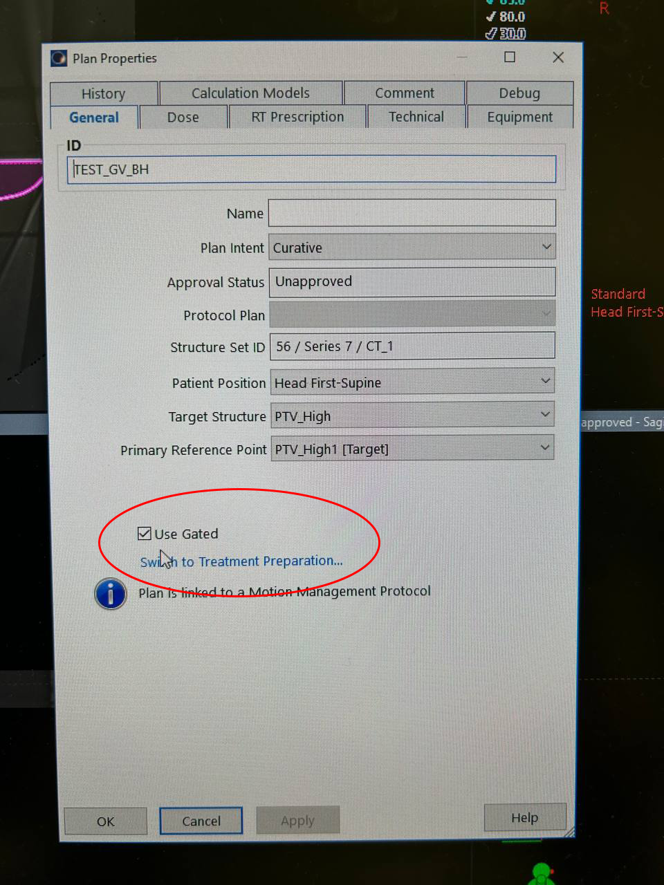

   Подключение гейтинга к плану

После этого активной станет гиперссылка *Switch to Treatment Preparation* - переходим по ней.

Перейдя по ссылке попадаем в следующее рабочее пространство :numref:`(Рис. %s) <_TBgating2>`.

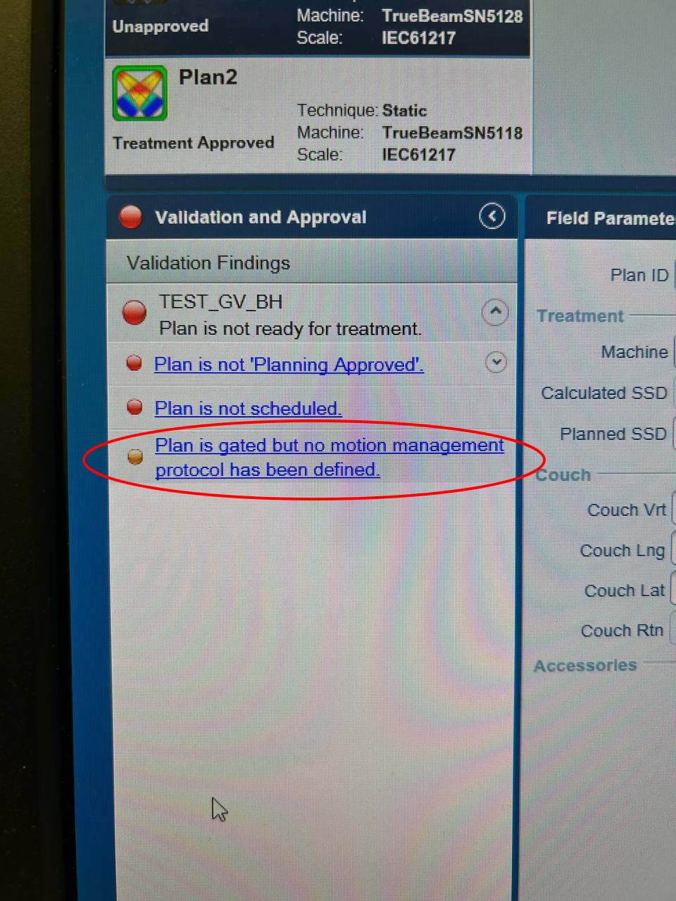

   Подключение протокола дыхательной кривой к плану (1)

Информационная система слева подсказывает нам, какие шаги необходимо выполнить, чтобы завершить подготовку плана с гейтингом: *Plan is gated but no motion protocol
has been defined* - К плану не прикреплена не одна дыхательная кривая. Нажимаем на данное сообщение.

Попадаем в рабочее пространство гейтинга, где, как указано на рисунке, необходимо выбрать нужную дыхательную кривую, после чего сохранить все изменения и
продолжить Scheduling плана :numref:`(Рис. %s) <_TBgating3>`.

.. tip::
   Дыхательная кривая, не подключенная ни к одному плану автоматически именуется как *НазваниеСессии: ДД-Мес-ГГ ЧЧ:ММ:СС (<no plan>)*

   Например, если на RGSC сессия названа 4D (и сделана 01.01.23 в 12:00:00), то при выборе протоколов (дыхательной кривой)
   высветится *4D: 01-Jan-23 12:00:00 (<no plan>).*  

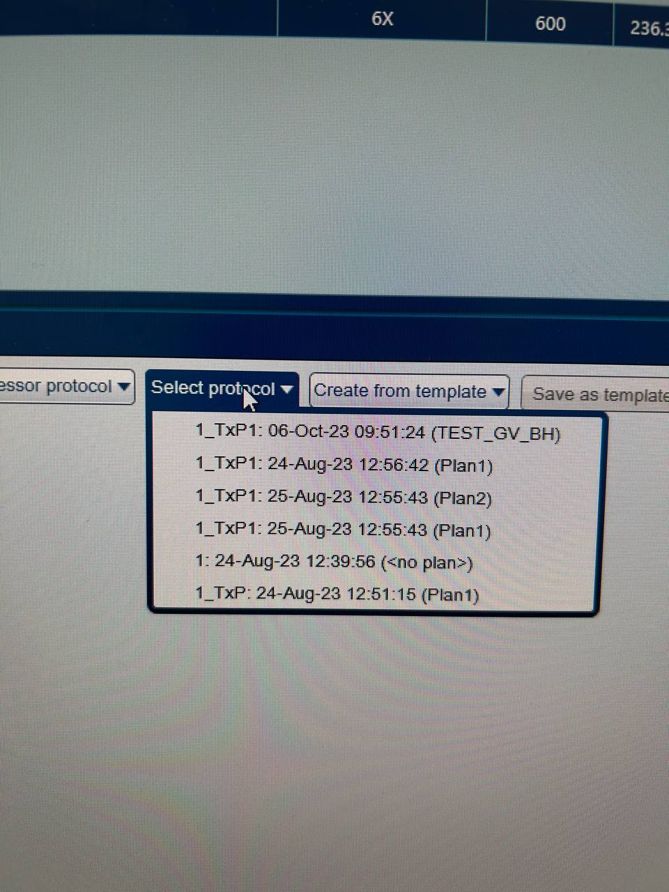

   Подключение протокола дыхательной кривой к плану (2)

Лечение на аппаратах
""""""""""""""""""""

Включение и выключение
~~~~~~~~~~~~~~~~~~~~~~

Укладка пациентов
~~~~~~~~~~~~~~~~~

Навигация
~~~~~~~~~

Axxent
------

Halcyon
-------

CT
---

Подготовка пациента к сканированию и лечению с контролем дыхания
~~~~~~~~~~~~~~~~~~~~~~~~~~~~~~~~~~~~~~~~~~~~~~~~~~~~~~~~~~~~~~~~

- При сканировании с контролем дыхания есть процедура обучения пациента и проверки способности пациента дышать правильно. 
  После этого принимается решение как именно сканировать.

- При выборе стратегии сканирования и лечения пациента есть три сценария развития событий:
  
  1. Пациент выдерживает задержку дыхания на 20-30 секунд, в данном положении мы выигрываем либо в уменьшении облучения здоровых тканей, либо в более точном облучении мишени (мишень имеет обширную экскурсию при дыхании) - выбираем гейтинг с задержкой дыхания.

  2. Пациенту тяжело задерживать дыхание, но при облучении в определенных его фазах мы выигрываем либо в уменьшении облучения здоровых тканей, либо в более точном облучении мишени (мишень имеет обширную экскурсию при дыхании) - выбираем фазовый гейтинг с планированием по 4DCT.

  3. Пациенту тяжело задерживать дыхание, но мишень имеет небольшую экскурсию при дыхании или гейтинг в определенных фазах не уменьшает нагрузку на критические органы - отказываемся от контроля дыхания при лечении (при этом для получения экскурсии можно провести 4DCT) и, как вариант, облучаем PTV = ITV + отступы на укладку и движение пациента.

CT с контролем дыхания
~~~~~~~~~~~~~~~~~~~~~~

**RGSC станция**

Система RGSC (Respiratory Gating for Scanners) состоит из двух блоков :numref:`(Рис. %s) <_rgsc>`: нижний должен быть включен постоянно, верхний - включается при 
необходимости запуска гейтинг-системы. В случаях аварийного выключения питания (или других форс-мажоров) сначала выключается верхний,
а затем нижний блок. Включение происходит в обратном порядке.

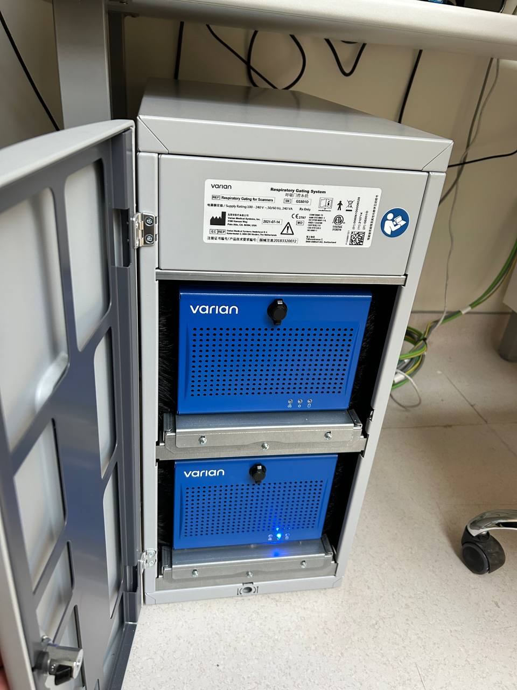

   Блоки RGSC станции

Сканирование с контролем дыхания
""""""""""""""""""""""""""""""""

**Задержка дыхания**

Врач, назначающий пациенту КТ с данным видом гейтинга (обычно исследование молочных желез) должен объяснить пациенту как тренировать дыхание дома
перед исследованием. Пациенту необходимо научиться задерживать дыхание на 20-30 секунд, чтобы легкие при этом находились в одном
положении (в пределах 4-6 мм). Непосредственно перед КТ 2-3 раза при выключенной записи в RGSC системе оператором наблюдается дыхательная кривая и
выставляются верхний и нижний пределы при задержке дыхания.

Топограммы (скауты) делаются при свободном дыхании для разметки. Затем включается запись дыхательной кривой в RGSC системе (кнопкой Record) и
запускают КТ, командуя при этом непосредственно перед запуском пациенту: "Глубоко вдохнуть и не дышать". После завершения КТ останавливают запись в RGSC системе,
утверждают выбранные пределы амплитуды (коридор около 4-6 мм) по дыхательной кривой и завершают исследование :numref:`(Рис. %s) <_BH>`. Дыхательная кривая при
этом автоматически прикрепляется к пациенту (начиная с версии ARIA 13.0).

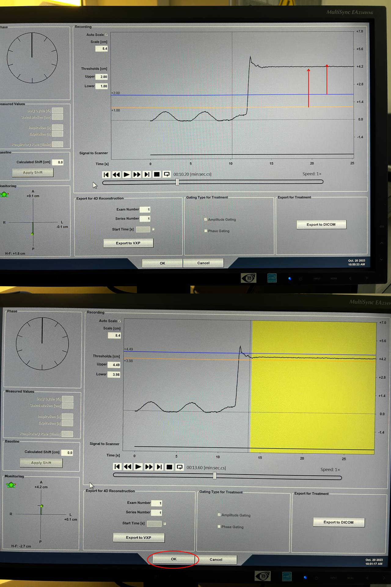

   Определение коридора задержки дыхания

**Фазовый гейтинг (4DCT)**

Для 4DCT исследования амплитуда дыхания пациента должна быть равномерной и достигать 4 мм - 5 см. 

.. warning:: 
   Очень важно, чтобы фамилия, имя, ID пациента, а также номер и серия исследования совпадали с введенными при создании пациента на RGSC 
   станции :numref:`(Рис. %s) <_ids>` и :numref:`(Рис. %s) <_examseries>`.

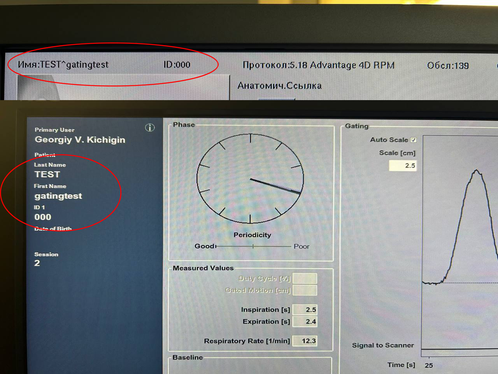

   Данные пациента на КТ и на RGSC станции

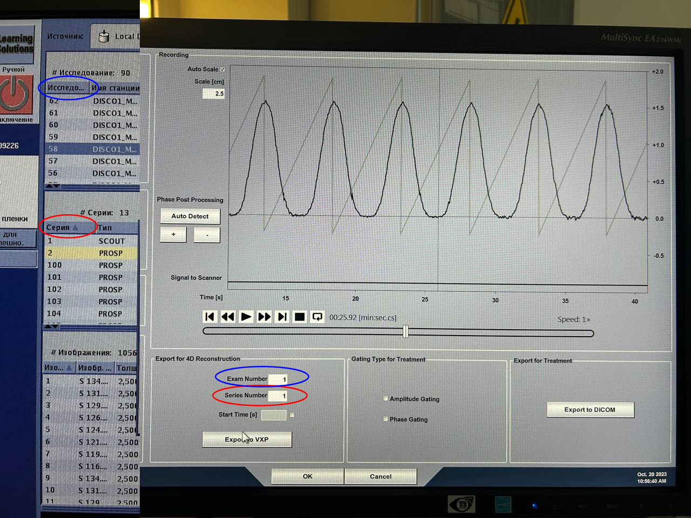

   Данные пациента на КТ и на RGSC станции при экспорте дыхательной кривой

После анализа системой дыхательной кривой пациента необходимо записать 2 расчетных параметра,
чтобы затем внести их в параметры 4D серии на КТ :numref:`(см. рис. %s) <_4dct>`.
На КТ выбирается протокол Advantage 4D RPM и в нем делаются топограммы (скауты) при выключенной записи в RGSC.
Затем, когда тип скана стал CINE мы вводим раннее записанные параметры в доступные для ввода параметры 4D скана и
запускаем сканирование, предварительно запустив запись кривой в RGSC системе :numref:`(рис. %s) <_breath>`. После завершения сканирования останавливаем
запись в RGSC системе и нажимаем экспорт в VXP. На компьютере КТ в Image Works находим сделанное 4DCT (выбираем нужную
серию) и открываем при помощи функции Advantage 4D, а в списке предложенных файлов находим записанную дыхательную кривую пациента
(экспортированную из RGSC системы в таком формате: *ID пациента_Номер исследования_Номер серии.vxp*, :numref:`(Рис. %s) <_vxp>` ) - собранное 4DCT
необходимо экспортировать в Eclipse для планирования.

.. note:: Папка с дыхательными кривыми в формате .vxp находится по адресу 10.166.129.2 (adv4dexport на компьютере RGSC), она разделяется между КТ и RGSC станцией.

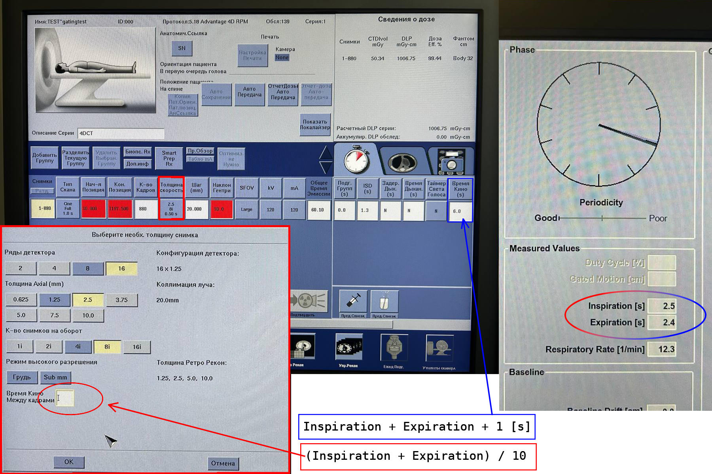

   Подготовка к 4D сканированию на КТ

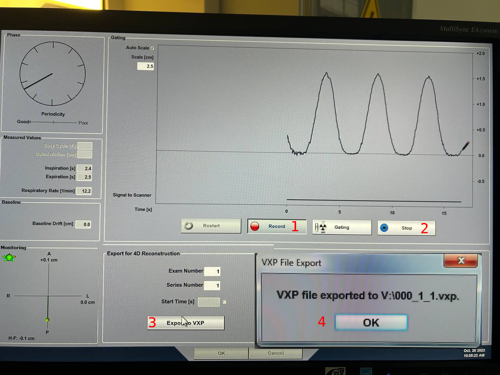

   Действия при 4D сканировании

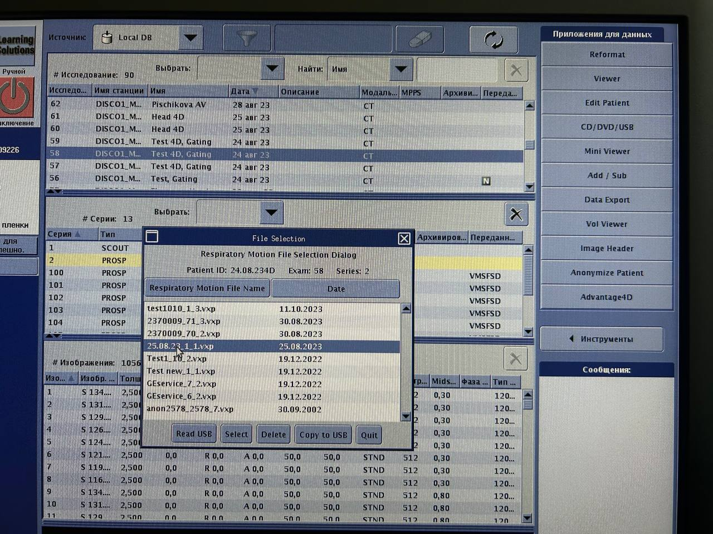

   Выбор дыхательной кривой для сбора 4DCT

Калибровка и верификация камеры Varian
""""""""""""""""""""""""""""""""""""""

Верификация камеры RGSC системы проводится по рекомендациям раз в 1-2 недели: для этого датчик с отражателями помещается во внутренний изоцентр КТ
(выставляется по лазерам), в начальном окне программы на станции RGSC выбираем Verification / Calibration и во вкладке с верификацией нажимаем OK.

Калибровка рекомендуется проводится раз в 1-2 месяца: для этого переходим во вкладку Calibration, на столе КТ размещаем бумагу, с расчерченными на ней позициями
для размещения датчика и выравниваем ее центральную позицию по внутренним лазерам КТ. Далее следуем инструкциям в программе RGSC станции, перемещая датчик по
всем позициям по часовой стрелке и нажимая OK в каждой из них :numref:`(Рис. %s) <_camcalib2>`.

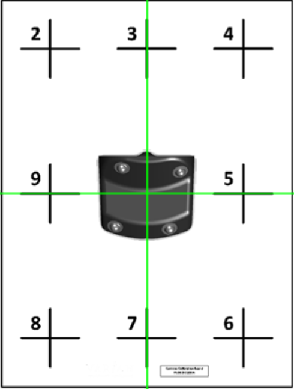

   Калибровка камеры

MRI
---

Верификация планов с помощью матрицы IBA
----------------------------------------

Матрица откалибрована по всем аппаратам и энергиям тормозного излучения.

Для начала верификации плана на матрице, нужно создать верификационный план, и в 
окне выбрать верификацию плана с помощью фантома (см. :numref:`рис. %s <_ver1>`).
При выборе фантома нужно выбрать матрицу с КТ под номером 3 (см. :numref:`рис. %s <_ver1>`).

.. figure:: images/Verification1.png
    :name: _ver1
    :align: center
    :width: 80%
    :figclass: align-center

    Окно выбора метода верификации и КТ матрицы.

В данном КТ учтено, что изоцентр находится на равноудаленном 
расстоянии от краев и находится на центре ионизационных камер (см. :numref:`рис. %s <_ver2>`).

.. figure:: images/Verification2.png
    :name: _ver2
    :align: center
    :width: 80%
    :figclass: align-center

    Расположение изоцентра

.. note:: Центр ионизационных камер находится на расстоянии 6 мм от поверхности матрицы (см. главу :ref:`dosimetry_equipment`).

После выбора КТ нужно рассчитать план, сделать approve и поставить в расписание аппарата.
Потом нужно скачать на носитель расчет дозы с помощью Eclipse. Для этого в нижнем левом меню находим 
вкладку Dose, нажимаем на правую кнопку мыши потом на Export  Dicom Media file….(см. :numref:`рис. %s <_ver3>`)

.. figure:: images/Verification3.png
    :name: _ver3
    :align: center
    :width: 40%
    :figclass: align-center

    Экспорт рассчитанной дозы

При экспорте не забываем выбрать куда экспортировать этот файл. 
Далее уже нужно выставить фантом на аппарат. На аппарате тоже 
нужно обеспечить попадания изоцентра в центр ионизационных камер, 
следовательно  по высоте ставим фантом между нижней и средней черной полосой, как показано на рисунке :numref:`рис. %s <_ver4>`

.. figure:: images/Verification4.png
    :name: _ver4
    :align: center
    :width: 80%
    :figclass: align-center

    Установка матрицы с фантомом по высоте

После подключения матрицы, нужно открыть пациента в ПО myQA и на аппарате. 
При работе в ПО myQA при проведении измерения не забыть выбрать калибровку. 
После измерения нужно импортировать файл с расчетами в ПО и начинать делать сравнительный анализ. 
По итогу мы должны увидеть такую картину как на рисунке :numref:`рис. %s <_ver5>`.

.. figure:: images/Verification5.png
    :name: _ver5
    :align: center
    :width: 80%
    :figclass: align-center

    Верификация плана в myQA

При проведении верификации планов облуения необходим следить за следующим:

#. Пациента (проект) можно создвавть вручную, а можно при импорте плана из DICOM файлов.
#. В процессе импорта необходимо выбирать плоскость XY и нулевые смещения изоцентра.
#. Необходимо убдиться, что аппарат и калибровка выбраны именно для используемого
   излучения (которое известно системе из RTPLAN).
#. Импортированный план должен был быть экспортирован в единицах дозы за фракцию, 
   а не суммарных дозах. Если это не было сделано правильно, 
   то в дозовом распределении нужно применить умножающий фактор **1 / количестов фракций**.
#. Обработку результатов нужно производить при следующих условиях ???
#. Криерием принятия плана являетс ???
#. По окончании верификаци необходимо рапечатать протокол в PDF назвав файл (???)
   и положив в папку (???).

Верификация планов с помощью портальной дозиметрии
---------------------------------------------------
Для верификации плана с помощью портальной дозиметрии создаем верификационный план и выбираем 
верификацию на портальной дозиметрии, не забываем выбрать SID= 100 см. (см. :numref:`рис. %s <_portalver1>`).

.. figure:: images/PortalVer1.png
    :name: _portalver1
    :align: center
    :width: 80%
    :figclass: align-center

    Окно выбора SID

После создания плана нужно сделать approve и 
перейти в plan scheduling  и сделать integrated image на всех полях как показано на рисунке (см. :numref:`рис. %s <_portalver2>`)

 .. figure:: images/PortalVer2.png
    :name: _portalver2
    :align: center
    :width: 80%
    :figclass: align-center

    Создание integrated image

После данных действий можно отпустить план на ускорителе.
Для просмотра результатов и дальнейшего анализа нужно зайти во вкладку Portal Dosimetry, 
как показано на :numref:`рис. %s <_portalver3>`

.. figure:: images/PortalVer3.png
    :name: _portalver3
    :align: center
    :width: 50%
    :figclass: align-center

    Просмотр результатов
