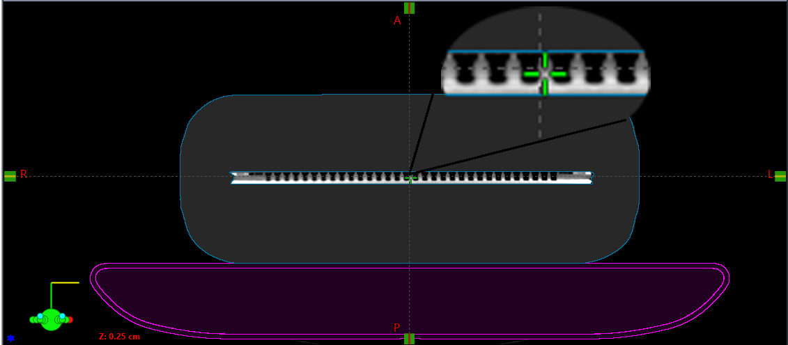

.. _instructions:

Рабочие инструкции для персонала
================================

TrueBeam
--------

Включение и выключение
~~~~~~~~~~~~~~~~~~~~~~

Укладка пациентов
~~~~~~~~~~~~~~~~~

Навигация
~~~~~~~~~

Axxent
------

Halcyon
-------

CT
--

Обучение пациента контролю дыхания
~~~~~~~~~~~~~~~~~~~~~~~~~~~~~~~~~~

- При сканировании с контролем дыхания есть процедура обучения пациента и проверки способности пациента дышать правильно. 
  После этого принимается решение как именно сканировать.

MRI
---

Верификация планов с помощью матрицы IBA
----------------------------------------

Матрица откалибрована по всем аппаратам и энергиям тормозного излучения.

Для начала верификации плана на матрице, нужно создать верификационный план, и в 
окне выбрать верификацию плана с помощью фантома (см. :numref:`рис. %s <_ver1>`).
При выборе фантома нужно выбрать матрицу с КТ под номером 3 (см. :numref:`рис. %s <_ver1>`).

.. figure:: images/Verification1.png
    :name: _ver1
    :align: center
    :width: 80%
    :figclass: align-center

    Окно выбора метода верификации и КТ матрицы.

В данном КТ учтено, что изоцентр находится на равноудаленном 
расстоянии от краев и находится на центре ионизационных камер (см. :numref:`рис. %s <_ver2>`).

    Расположение изоцентра

.. note:: Центр ионизационных камер находится на расстоянии 6 мм от поверхности матрицы (см. главу :ref:`dosimetry_equipment`).

После выбора КТ нужно рассчитать план, сделать approve и поставить в расписание аппарата.
Потом нужно скачать на носитель расчет дозы с помощью Eclipse. Для этого в нижнем левом меню находим 
вкладку Dose, нажимаем на правую кнопку мыши потом на Export  Dicom Media file….(см. :numref:`рис. %s <_ver3>`)

.. figure:: images/Verification3.png
    :name: _ver3
    :align: center
    :width: 40%
    :figclass: align-center

    Экспорт рассчитанной дозы

При экспорте не забываем выбрать куда экспортировать этот файл. 
Далее уже нужно выставить фантом на аппарат. На аппарате тоже 
нужно обеспечить попадания изоцентра в центр ионизационных камер, 
следовательно  по высоте ставим фантом между нижней и средней черной полосой, как показано на рисунке :numref:`рис. %s <_ver4>`

.. figure:: images/Verification4.png
    :name: _ver4
    :align: center
    :width: 80%
    :figclass: align-center

    Установка матрицы с фантомом по высоте

После подключения матрицы, нужно открыть пациента в ПО myQA и на аппарате. 
При работе в ПО myQA при проведении измерения не забыть выбрать калибровку. 
После измерения нужно импортировать файл с расчетами в ПО и начинать делать сравнительный анализ. 
По итогу мы должны увидеть такую картину как на рисунке :numref:`рис. %s <_ver5>`.

.. figure:: images/Verification5.png
    :name: _ver5
    :align: center
    :width: 80%
    :figclass: align-center

    Верификация плана в myQA

При проведении верификации планов облуения необходим следить за следующим:

#. Пациента (проект) можно создвавть вручную, а можно при импорте плана из DICOM файлов.
#. В процессе импорта необходимо выбирать плоскость XY и нулевые смещения изоцентра.
#. Необходимо убдиться, что аппарат и калибровка выбраны именно для используемого
   излучения (которое известно системе из RTPLAN).
#. Импортированный план должен был быть экспортирован в единицах дозы за фракцию, 
   а не суммарных дозах. Если это не было сделано правильно, 
   то в дозовом распределении нужно применить умножающий фактор **1 / количестов фракций**.
#. Обработку результатов нужно производить при следующих условиях ???
#. Криерием принятия плана являетс ???
#. По окончании верификаци необходимо рапечатать протокол в PDF назвав файл (???)
   и положив в папку (???).

Верификация планов с помощью портальной дозиметрии
---------------------------------------------------
Для верификации плана с помощью портальной дозиметрии создаем верификационный план и выбираем 
верификацию на портальной дозиметрии, не забываем выбрать SID= 100 см. (см. :numref:`рис. %s <_portalver1>`).

    Окно выбора SID

После создания плана нужно сделать approve и 
перейти в plan scheduling  и сделать integrated image на всех полях как показано на рисунке (см. :numref:`рис. %s <_portalver2>`)

 .. figure:: images/PortalVer2.png
    :name: _portalver2
    :align: center
    :width: 80%
    :figclass: align-center

    Создание integrated image

После данных действий можно отпустить план на ускорителе.
Для просмотра результатов и дальнейшего анализа нужно зайти во вкладку Portal Dosimetry, 
как показано на :numref:`рис. %s <_portalver3>`

.. figure:: images/PortalVer3.png
    :name: _portalver3
    :align: center
    :width: 50%
    :figclass: align-center

    Просмотр результатов
