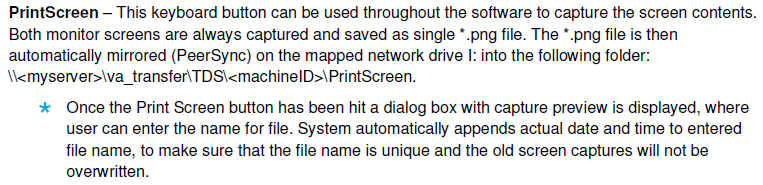
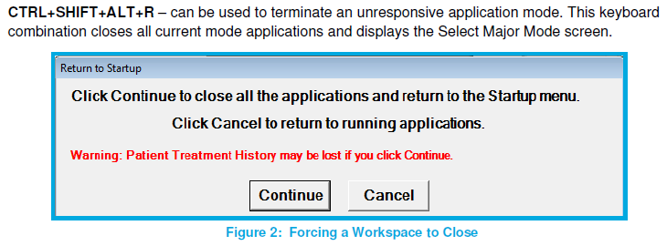
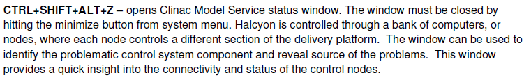
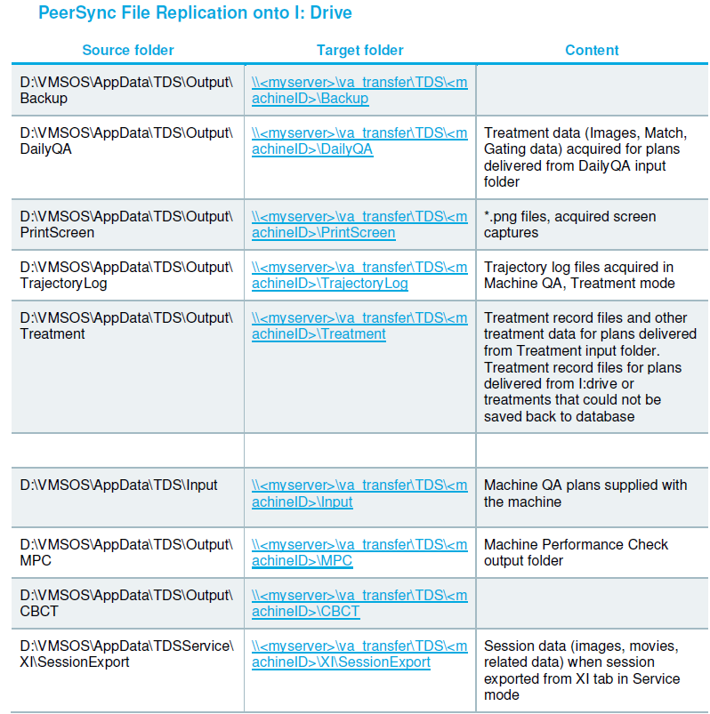
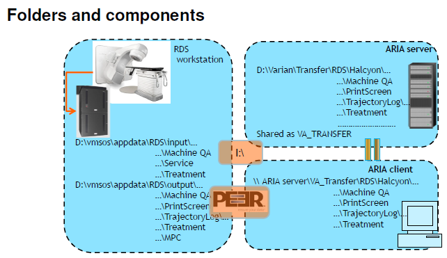

.. _troubleshooting:

Поиск неисправностей
====================

Раздел посвящен пониманию принципов поисков и устранения неисправностей.

Общие принципы
--------------

#. При возникновении интерлоков нужно смотреть 
   *tooltips* поверх индикаторов неисправности.
   Более детальное описание условий возникновения интерлоков 
   следует смотреть в документе **???**
#. Интерлоки часто возникают группами в следствие единственной причины,
   выявление которой не очевидно. Нужен опыт и обращение к разделам 
   описания реально возникающих ситуаций на конкретных аппаратах
#. Систематический подход заключается в обращении к документам типа 
   **Worflows (???)** и к главному первоисточнику **DATABOOK**.

TrueBeam
--------

Аппарат по каким-то причинам выключен или в **STDBY**
~~~~~~~~~~~~~~~~~~~~~~~~~~~~~~~~~~~~~~~~~~~~~~~~~----

Типичный сценарий когда вы после выходных приходите и тишина.

Проблемы внешней системы охлаждения
~~~~~~~~~~~~~~~~~~~~~~~~~~~~~~~~~~~

Проявляется как появление интерлока **COOL**.

Проверить уровень воды во внутреннем контуре системы охлаждения.
Находится с левой стороны стойки аппарата.
Уровень должен быт в отмеченных на шкале пределах.
Если выходит за них, то проверить, нет ли течи в шлангах системы охлаждения,
если нет, долит дистиллированную воду. 

В некоторых случаях утром может быть вследствие слишком холодной воды 
во внешнем контуре и недостатке подогрева в **CTDBY**.
Нужно вывести аппарат из **CTDBY** и некоторое время подождать.

Более серьезная проблема - это неисправность системы внешнего охлаждения.
Сначала нужно проверить показатели манометра и потока воды на задней стене за аппаратом.
Они должны быть в пределах **???**.
Затем в сервисном режиме проверить температуру воды во внешнем контуре.
Она должна быть в пределах **???**.

При установлении неисправности внешней системы охлаждения следует обратиться в 
инженерную службу центра и сообщить о проблеме.

Проблемы газа
~~~~~~~~~~~~~

Проявляется как интерлок **GAS**.

Следует проверить показания манометра давления газа SF6, 
находящегося с левой стороны в стойке в стойке аппарата.
Если давление существенно меньше нормы, то велика вероятность серьезной течи, 
нуждающейся в устранении до того как будет потерян весь газ из баллона.
Для этого нужно обратиться в сервисную службу Varian.
Если падения давления незначительно, то нужно добавить газ до нормы 
и следить за его расходом внимательнее.

Дозиметрические интерлоки
-------------------------

Если излучение просто не включается, то следует обратиться в 
сервисную службу или квалифицированному специалисту.
Если сбои происходят случайно и достаточно часто, то вероятно 
какие-то настройки ушли. В этом случе так же нужен квалифицированный специалист.

Специальные консольные инструменты
----------------------------------

Halcyon
~~~~~~~

На рисунках :numref:`(Рис. %s) <_halcyon_print_screen_shortcut-figure>`,
:numref:`(Рис. %s) <_terminate_unresponcive_shortcut-figure>`
и :numref:`(Рис. %s) <_service_status_shortcut-figure>`
представлены конды консоли для ...

    Вывод содержимого экрана в файл в разделяемой папке

    Перезапуск сервисов, например когда приложения перестают отвечать

    Вывод сервисного окна со статусом оборудования

На рисунке :numref:`(Рис. %s) <_drive_i_folders-figure>`
представлено назначение папок разделяемого диска **I:**, 
физически расположенного на сервере.

    Назначение папок разделяемого диска

На рисунке :numref:`(Рис. %s) <_folders_and_components-figure>`
показаны компоненты и папки Vаrian.
Во всех режимах кроме лечебного консоль не имеет доступа к *Aria*.
Поэтому загрузка контрольных планов происходим через чтение *DICOM* файлов с диска **I:**.
Данные, генерируемые в процессе использования служебных процедур сохраняются локально на консольном диске **D:**.
Однако, специальный сервис **PEER** синхронизирует их с диском **I:**, 
к которому пользователь имеет доступ и может их анализировать.

    Папки и компоненты
