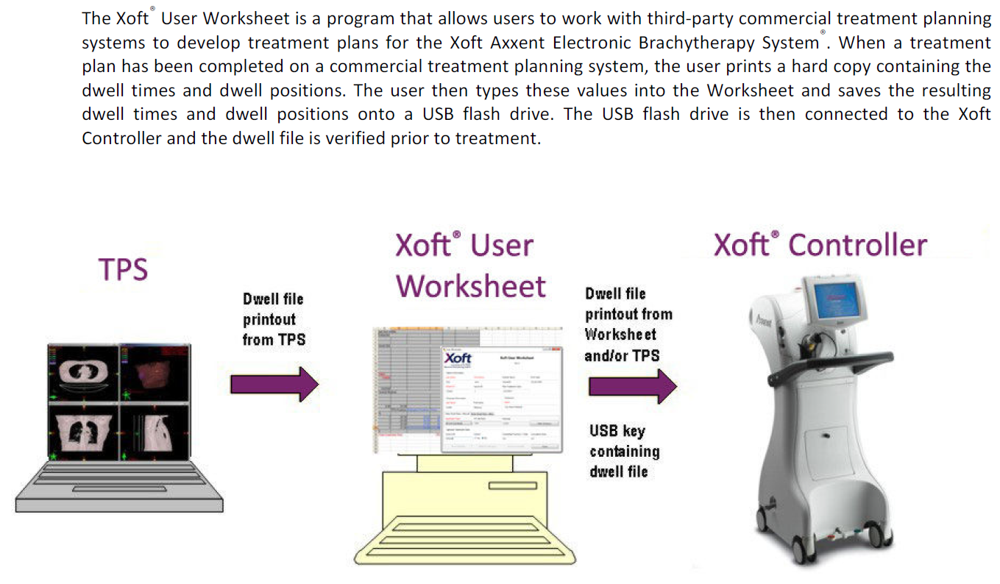
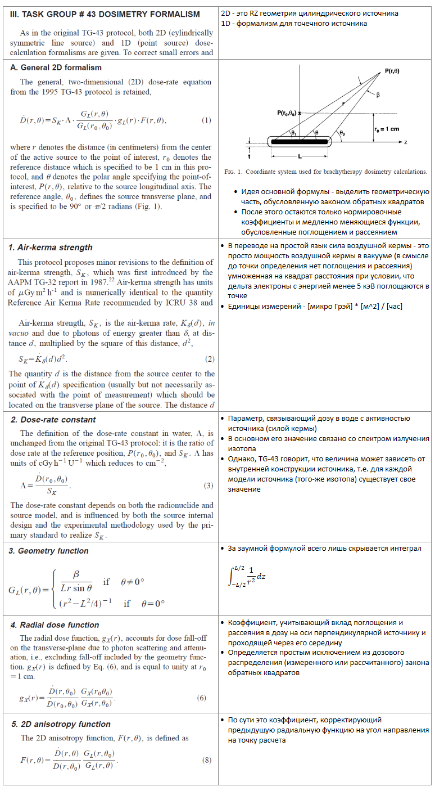

.. _config_axxent:

Commissioning брахитерапии Axxent
=================================

.. note:: 

   - **NIST air-kerma rate standard** - похоже это новый стандарт для дозиметрии
     рентгеновских брахитеапевтических источников.
     В чем он заключатся? Реализует ли его Eclipse?
   - Начиная с версии 2.04 **Xoft S700 sourse data** в BrachyVision нужно вносить
     изменения в связи с изменением стандарта. При этом еще упоминается, что 
     что ADCL во время регулярной раз в два года калибровки колодезной камеры
     будут внесены изменения в калибровку в соответствии с новым стандартом.
   - Для разбирательства с предметом рекомендуются две статьи , .
   - По QA есть отдельный небольшой документ с таблицами что и как часто нужно делать.
   - На *floppy* с ресурсами есть пока не понятная программа *XoftForm*.
     Возможно это некий генератор создающий план вручную и выводящий 
     результаты в полностью удовлетворяющим аппарат виде включая
     штрих коды для считывания при лечении. С ним еще связаны атласы в формате XML.
     Возможно это некая система использования атласного планирования при лечении.

Seltzer SM, et al, New national air-kerma standard for low-energy
electronic brachytherapy sources. Journal of Research of the National
Institute of Standands and Technology 119, 554-574 (2014).
http://dx.doi.org/10.6028/jres.119.022

DeWerd LA, et al, A modified dose calculation formalism for electronic
brachytherapy source. Brachytherapy 14, 405-408 (2015).
http://dx.doi.org/10.1016/j.brachy.2015.01.003

Передача плана из Eclipse в аппарат Axxent
------------------------------------------

Прямой связи между системой планирования и аппаратом нет.
Процесс заключается в ручном вводе в программе **Xoft User Worksheet**
позиций стояния источника и создания с ее помощью управляющего файла на флэшке.
На рисунке :numref:`(Рис. %s) <_xoft_user_worksheet-figure>`
представлено обоснование решения производителя и схема работы.

    Обоснование решения производителя и схема работы по 
    передаче плана облучения от системы планирования в аппарат

.. todo::
    
  #. Установить программу и дополнить описание по итогам практического использования,
     возможно еще раз после работы непосредственно на аппарате.

Формализм TG-43
---------------

Всемирно признанным протоколом дозиметрии в брахитерапии 
является протокол **AAPM TG-43**. 
На рисунке :numref:`(Рис. %s) <_tg43_formalism-figure>`
представлено исчерпывающее описание его формализма.

    Формализм дозовых расчетов по протоколу **TG-43**

