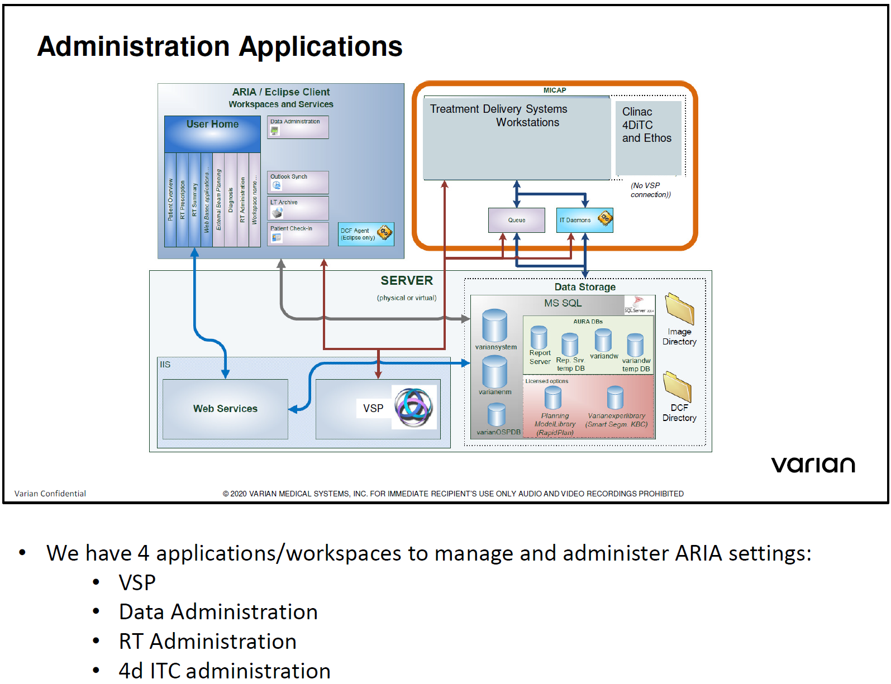

.. _config_rv:

Конфигурация информационной системы
===================================

Архитектура конфигурации **ARIA**
---------------------------------

На рисунке :numref:`(Рис. %s) <_admin_apps-figure>`
представлены данные о приложениях, участвующих в администрировании **ARIA**.

    Приложения, связанные с администрированием **ARIA**

Параметры конфигурации **Aria**
-------------------------------

Пользователи и права
~~~~~~~~~~~~~~~~~~~~

Существует только две группы пользователей, имеющих отношение к оборудованию *Varian*:

- **Varian Application Users** group 
  (*участники могут запускать все приложения Varian*)
- **Varian Administrators** group
  (*участники могут бслуживать Varian Applications*)

**VSP** - *Varian Service Portal* - приложение, в котором регистрируются пользователи 
для входа в OS Windows.

Архитектура компьютерной сети
-----------------------------

Архитектура баз данных SQL
--------------------------
