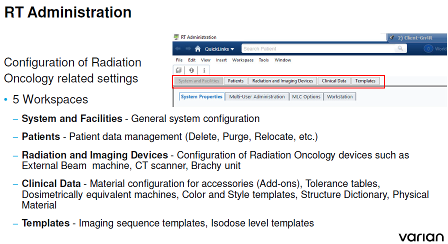

.. _config_rv:

Конфигурация информационной системы
===================================

Архитектура конфигурации **ARIA**
---------------------------------

На рисунке :numref:`(Рис. %s) <_admin_apps-figure>`
представлены данные о приложениях, участвующих в администрировании **ARIA**.

На рисунке :numref:`(Рис. %s) <_rtadmins-figure>`
представлены разделы системы администрирования **RT Administration**.

.. figure:: images/AdminApps.png
    :name: _admin_apps-figure
    :align: center
    :width: 80%
    :figclass: align-center

    Приложения, связанные с администрированием **ARIA**

    Разделы системы администрирования **RT Administration**

Пользователи и права
--------------------

Существует только две группы пользователей, имеющих отношение к оборудованию *Varian*:

- **Varian Application Users** group 
  (*участники могут запускать все приложения Varian*)
- **Varian Administrators** group
  (*участники могут бслуживать Varian Applications*)

**VSP** - *Varian Service Portal* - приложение, в котором регистрируются пользователи 
для входа в OS Windows.

Общие настройки (*System and Facilities*)
-----------------------------------------

Параметров много. Большинство не существенные типа способа представления информации.
Разбираться нужно по мере необходимости.
Для понимания масштаба и возможностей пока только список вопросов на заметку.

#. Контроль целостности планов.
#. Системы координат планирования.
#. MLC, материалы, ...
#. Словари структур
#. Крайне важная информация о геометрии ускорителей с расстояниями и размерами начиная со страницы 160 учебного курса.

Архитектура компьютерной сети
-----------------------------

Архитектура баз данных SQL
--------------------------

.. todo::

  #. К администрированию относятся не только аппараты но и объекты практической работы типа пациентов. 
     Эта другая часть временно откладывается в конец очереди.
     Занятся когда настанет реальная необходимость.
