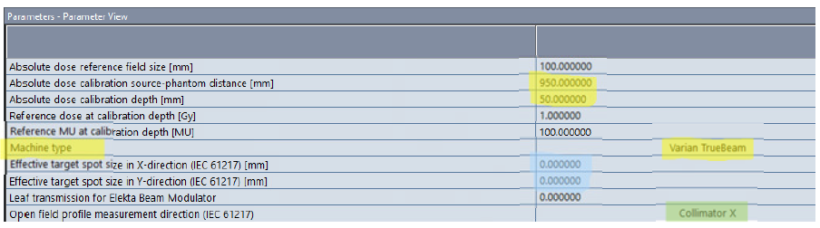

.. _config_tps:

Конфигурация системы планирования
=================================

.. note:: 

   Глобально непонятна последовательность действий по настройке всего комплекса в части дозиметрии.
   В учебном курсе почему-то сначала описывается закладка дозиметрии и ее настройка вплоть до approval
   и только потом в **RT Administration** определяются дозиметрические данные для аппаратов.
   Казалось бы все должно быть наоборот. Как это понимать?

Архитектура конфигурации **Eclipse**
------------------------------------

Описание дистанционных аппаратов
--------------------------------

Определение аппаратов (ускорители, CT, симуляторы, брахитерапия и т.д.) происходит по ссылке
**RT Administration** -> **Radiation and Imaging Devices**.

Аппараты можно создавать импортируя из XML файла или с помощью *Wizard*.
Описание процесса содержится в учебном руководстве начиная со страницы 167.

На рисунке :numref:`(Рис. %s) <_truebeam_head-figure>`
геометрия радиационной головки **TrueBeam** и **TrueBeam STx**.

.. figure:: images/TrueBeamHead.png
    :name: _truebeam_head-figure
    :align: center
    :width: 100%
    :figclass: align-center

    Геометрия радиационной головки TrueBeam и TrueBeam STx.

Определение CT томографов и их калибровка
-----------------------------------------

Определение CT томографа происходит по ссылке
**RT Administration** -> **Radiation and Imaging Devices**.

Работа с томографами описывается в
`учебном руководстве <./data/varian/Eclipse_16.1_Commissioning-Admin_and_Physics.pdf>`_
начиная со страницы 216 в 
`руководстве по администрированию <./data/varian/ARIA_Radiation_Therapy_Management_RT_Administration_16.1_Reference_Guide.pdf>`_
со страницы 26.

Среди настроек есть параметры, по которым определяется сканер из DICOM Tags.

Интерпретация чисел Хаусфильда зависит от алгоритма расчета дозы.
Описание приводится на рисунке :numref:`(Рис. %s) <_ct_vs_algorihm-figure>`.

.. figure:: images/CT_vs_Algorihm.png
    :name: _ct_vs_algorihm-figure
    :align: center
    :width: 80%
    :figclass: align-center

    Интерпретация чисел Хаусфильда в зависти от алгоритма расчета дозы.

Распределенные вычисления (**DCF**)
-----------------------------------

**DCF** инфраструктура распределенных вычислений обслуживает расчет дозы и оптимизацию в *Eclipse*.
В состав входят **Distributor** и **Agents**.
Распределитель располагается на сервере баз данных.
Агенты на клиентски станциях. 

**Distributor** работает как сервис *Varian DCF Distributor*.
Предоставляет информацию о своей работе через встроенный *HTTP server*.

**Agent** работает как сервис *Varian DCF Agent*.
Запускает серванты.

**Servant** представляет собой исполняемую программу и DCF-interface library (*VCServant.DLL*).
Реализует алгоритмы расчета дозы.
Каждый предоставляет один или более вычислительный сервис.

**GPU servant** может считать *Acuros* и *PO/FTDC* на *GPU*.
*GPU* может устанавливаться на локальной машине и на сервере (**FAS**)

Вычислительные алгоритмы **Eclipse**
------------------------------------

На рисунке :numref:`(Рис. %s) <_eclipse_algorithms-figure>`
перечислены все вычислительные алгоритмы *Eclipse*.

.. figure:: images/EclipseAlgorithms.png
    :name: _eclipse_algorithms-figure
    :align: center
    :width: 100%
    :figclass: align-center

    Вычислительные алгоритмы **Eclipse**.

Для расчетов требуются алгоритмы и данные полей облучения.
*Leaf Motion Calculation* (**LMC**) не нуждается в полях облучения.
Поэтому в конфигурации *LMC* не отражается.

Модели полей облучения
----------------------

Модели полей облучения организованы в структуру *machine* **add-ons**. 

Каждая модель имеет собственную разделяемую папку на сервере в разделе:

.. code-block:: none

    \\m66-vcom-01\DCF$\client\BeamData

В корне каждого алгоритма лежит файл **mapfile.txt**.
В нем содержится привязка модели полей облучения к аппарату.
Менять этот файл вручную нельзя.

Модели источника
----------------

Модели логично разделяют источники на компоненты (идентично Амфоре):
первичный, рассеяние в головке, загрязняющие электроны и рассеяние в твердом клине.

Моделирование источника подробно рассматривается в учебном руководстве начиная со страницы 259.

Алгоритмы расчета дозы
----------------------

Anisotropic Analytical Algorithm (AAA) for Photons
~~~~~~~~~~~~~~~~~~~~~~~~~~~~~~~~~~~~~~~~~~~~~~~~~~

Подробно рассматривается в учебном руководстве начиная со страницы 275.

Acuros External Beam Algorithm
~~~~~~~~~~~~~~~~~~~~~~~~~~~~~~

Подробно рассматривается в учебном руководстве начиная со страницы 294.

*Linear Boltzmann Transport Equaion* (**LBTE**) solver by Todd Wareing and John McGhee (Tanspire Inc).

Electron Monte Carlo Algorithm (**eMMC**)
~~~~~~~~~~~~~~~~~~~~~~~~~~~~~~~~~~~~~~~~~

Подробно рассматривается в учебном руководстве начиная со страницы 331.

Включает модель источника и модель транспорта.
Источник моделируется пятью подисточниками.
Основывается на предварительных расчетах различных типов машин.

Наборы экспериментальных данных и конфигурация
----------------------------------------------

Открытые поля
~~~~~~~~~~~~~

Замечания входным данным:

- Все относительные измерения должны быть при одном *SPD*.
- Измерения для калибровки по абсолютной дозе могут быть при другом *SPD*.
- Поперечные профили могут быть вдоль in-plane (Y) или crosplane (X).
- **Effective spot size** (X and Y) существенно влияет на мониторные единицы малых полей и хвосты. 
  Их величину можно (и нужно) подстраивать позднее сравнивая измеренные и расчетные данные.
  **Важно!** Предметом неопределенности является ориентация шторок коллиматора. 
  Мы проводили измерения перпендикулярно оси ротации ускорителя при угле поворота коллиматора 0 градусов.
  **Какой паре шторок соответствуют эти измерения?**
  Системы координат *IEC-61217* показаны на рисунке 
  :numref:`(Рис. %s) <_IEC_61217_coordinates-figure>`.
- Дополнительный туман возникает из-за рекомендаций разных размеров в зависимости от алгоритма.

.. figure:: images/IEC_61217_Coordinates.png
    :name: _IEC_61217_coordinates-figure
    :align: center
    :width: 60%
    :figclass: align-center

    Системы координат стандарта *IEC-61217*

Помимо собственно профилей и факторов вывода, которые понятны, есть набор параметров, 
понимание которых и определение может вызывать затруднения.
На рисунке :numref:`(Рис. %s) <_beam_config_parameters-figure>`
представлен набор таких параметров с пометками из учебного пособия.

    Численные параметры в конфигурации дозиметрии TrueBeam

Замечания по работе commissioning:

- Конфигуратор берет среднее между левой и правой частями профилей.
- Для определения симметрии используется уровень 50% для излучений с ровными профилями.
  При полях без выравнивающего фильтра привязка к расположению максимального градиента.
  При этом речь о проверке симметрии. 
  Если отклонение края превышает 3.2 мм, то измерение игнорируется с соответствующим предупреждением.
  В противном случае профиль сдвигается относительно вытекающего из размера поля края.
  *Остается непонятным, как обрабатывается ситуация с несовпадающим размером поля.
  Возможно сдвиг происходит после усреднения.
  В этом случае наша предобработка с центрированием профилей важна*.

MLC
~~~

**Transmission**:

- Для каждой энергии одно значение.
- Измерения при полностью закрытом MLC, когда место встречи лепестков находится за шторками.
- Область измерений берется достаточно большой для усреднения по областям под лепестками и между ними.
- Берется среднее для банка A и B.

**Dosimetric Leaf Gap** - моделирует проникновение излучения через скругленные торцы лепестков.
Подробная информация в статье :cite:`LoSasso1998-xh`.

**Tongue and Groove** - измерения не требуются.
Моделирование *MLC* осуществляется во всех алгоритмах расчета.
Надо полагать, что парамеры *Tongue & Groove* в современных версиях 
моделируется внутри, что и объясняет отсутствие параметра в конфигурации.
Более подробная информация в главе 12 
`руководства по алгоритмам <./data/varian/Eclipse_16.1_Photon_and_Electron_Algorithms_Reference_Guide.pdf>`_

.. note:: 

   *DLG and Leaf Transmission* задаются в *RT Administration* для каждой машины и энергии.
   В новых версиях их можно задавать еще и для каждого алгоритма при конфигурации дозиметрии.
   Если это сделано, то значения в *RT Administration* игнорируются.
   Тем не менее, в *RT Administration* их по-прежнему необходимо указывать 
   (`учбное руководство <./data/varian/Eclipse_16.1_Commissioning-Admin_and_Physics.pdf>`_, стр. 474).

EDW
~~~

Используются данные открытых полей, параметры вторичного источника *EDW*, и таблицы *STT*. 

**Что такое параметры вторичного источника EDW????**

Перенос измеренных данных из алгоритма в алгоритм
~~~~~~~~~~~~~~~~~~~~~~~~~~~~~~~~~~~~~~~~~~~~~~~~~

Стандартная последовательность конфигурации дозиметрии подразумевает 
импорт измеренных профилей и факторов выхода в одном алгоритме (**AAA**).
при переходе к следующему алгоритму нужно использовать уже введенные для первого экспериментальные данные.
Делается это следующим образом.

#. Для выбранного алгоритма добавляется *add-on* открытого поля.
#. Далее **File -> Import -> Eclipse Beam Data**
#. В диалоговой форме выберите папку с данными для алгоритма  из которого будут копироваться данные

   .. code-block:: none

       \\m66-vcom-01\DCF$\client\BeamData\Algorithm

#. В форме будет список всех доступных данных для данного алгоритма независимо от энергии и конкретного аппарата.
   Поэтому выбирать следует внимательно. Главным идентификатором является трехбуквенное название папки данных.
   Оно должно соответствовать той паке, откуда предполагается копирование. 
   Другими идентификаторами являются название аппарат и энергия.

#. Затем появится диалог по **Matching** (привязке, подгонке). Нужно подогнать все и выбрать к использованию все.
#. Будут скопированы все исходные данные включая параметры *MLC*.
#. Далее выполняется расчет всех *add-on*. 
   При импорте могут копироваться и результаты расчетов предыдущего алгоритма. 
   Здесь следует обязательно производить перерасчет.

Электроны
---------

Заметки:

- В конфигурации могут использоваться профили в воздухе без аппликаторов,
  но при положении шторок, соответствующих положении для аппликатора.
  Это необязательно, но неожиданно.

Описание конфигурации электронов в `учебном руководстве <./data/varian/Eclipse_16.1_Commissioning-Admin_and_Physics.pdf>`_
начинается на стр. 521.

DICOM импорт и экспорт
----------------------

Настройки Eclipse
~~~~~~~~~~~~~~~~~

Eclipse импорирует и экспортирует данные в формате DICOM включая объекты **RT**, 
используемые для обмена с другими системами данными планирования и передачи верификационных плнов,
тремя способами:

- стандартный путь к сетевой папке (расположенной на сервере *ARIA*), 
  куда изображения помещает серверный *DICOM* сервис *Varian* и 
  который прописан для отправки на **КТ** и **МРТ** как одно из стандартных мест передачи исследований,
- произвольная файловая папка включая *CD* диски пациента, которую можно выбрать при импорте в любой момент,
- прямой запрос исследований у **GEPACS**, работа с которым описана более подробно далее. 

Настройка взаимодействия с **GEPACS**
~~~~~~~~~~~~~~~~~~~~~~~~~~~~~~~~~~~~~

Настройка доступа к GEPACS в Eclipse выполняетс на каждой рабочей станции один раз.
В случае отсутствия настройки или каких-то других причин конфигурация выполняется следующим образом.

#. В импорте / экспорте на первом шаге визарда нажать кнопку **Manage...**
 
#. В появившейся форме, показанной на рисунке :numref:`(Рис. %s) <_importConfig-figure>`,
   дайте команду **Add...** или **Configure...**.

   .. figure:: images/ImportConfig.png
       :name: _importConfig-figure
       :width: 100%
       :figclass: align-left

       Форма управления устройствами для обмена *DICOM* данными

#. В появившейся форме :numref:`(Рис. %s) <_dicomImportFilterType-figure>` 
   выберите тип интерфейса **DICOM Query Retrieve Import Filter**

   .. figure:: images/DicomImportFilterType.png
       :name: _dicomImportFilterType-figure
       :width: 60%
       :figclass: align-left

       Типы интефейсов для работы с *DICOM*

#. На рисунке :numref:`(Рис. %s) <_PACS_config-figure>` 
   показан пример настройки доступа к **GEPACS**.
   Для каждой станции нужно указать свой **AE Title**. 
   Он состоит из префикса **AET_** и, затем, имени хоста станции станции заглавными буквами. 
   Для доступа **GEPACS** должен знать и разрешать доступ по *IP* адресу и *AE Title* клиентского компьютера.
   На старте в нем указаны рабочие станции *Eclipse* и оконтуривания. 

   .. figure:: images/PACS_config.png
       :name: _PACS_config-figure
       :width: 100%
       :figclass: align-left
       
       Настройка доступа к **GEPACS**

Работа с **GEPACS** в **Eclipse**
~~~~~~~~~~~~~~~~~~~~~~~~~~~~~~~~~

При загрузке исследований с сервера типа **GEPACS** единственным отличием 
процедуры является наличие фильтра исследваний как оказано на рисунке 
:numref:`(Рис. %s) <_dicomImportRequest-figure>`.
Необходимо следит за регистром текста, так как *GEPACS* различает заглавные и прописные буквы.

    
    Импорт из PACS
