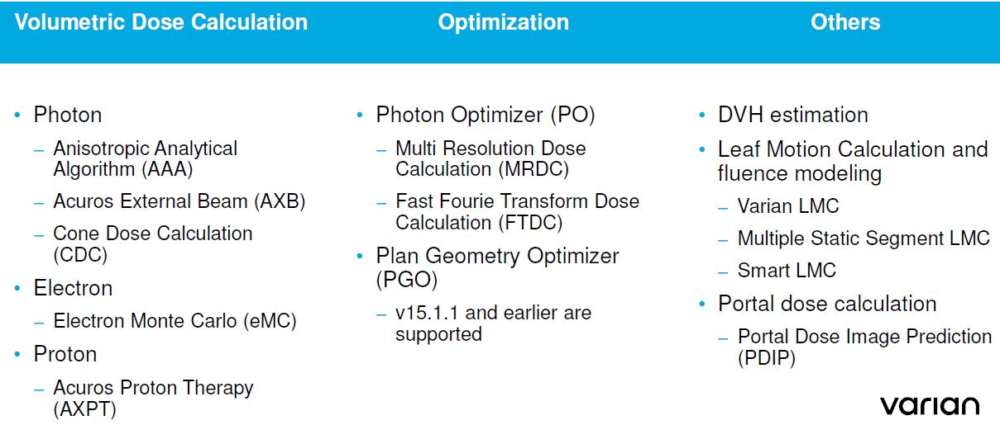

.. _config_tps:

Конфигурация системы планирования
=================================

Архитектура конфигурации **Eclipse**
------------------------------------

Описание дистанционных аппаратов
--------------------------------

Определение аппаратов (ускорители, CT, симуляторы, брахитерапия и т.д.) происходит по ссылке
**RT Administration** -> **Radiation and Imaging Devices**.

Аппараты можно создавать импортируя из XML файла или с помощью *Wizard*.
Описание процесса содержится в учебном руководстве начиная со страницы 167.

На рисунке :numref:`(Рис. %s) <_truebeam_head-figure>`
геометрия радиационной головки **TrueBeam** и **TrueBeam STx**.

.. figure:: images/TrueBeamHead.png
    :name: _truebeam_head-figure
    :align: center
    :width: 100%
    :figclass: align-center

    Геометрия радиационной головки TrueBeam и TrueBeam STx.

Определение CT томографов и их калибровка
-----------------------------------------

Определение CT томографа происходит по ссылке
**RT Administration** -> **Radiation and Imaging Devices**.

Работа с томографами описывается в учебном руководстве начиная со страницы 216.

Среди настроек есть параметры, по которым определяется сканер из DICOM Tags.

Интерпретация чисел Хаусфильда зависит от алгоритма расчета дозы.
Описание приводится на рисунке :numref:`(Рис. %s) <_truebeam_head-figure>`.

    Интерпретация чисел Хаусфильда в зависти от алгоритма расчета дозы.

Распределенные вычисления (**DCF**)
-----------------------------------

**DCF** инфраструктура распределенных вычислений обслуживает расчет дозы и оптимизацию в *Eclipse*.
В состав входят **Distributor** и **Agents**.
Распределитель располагается на сервере баз данных.
Агенты на клиентски станциях. 

**Distributor** работает как сервис *Varian DCF Distributor*.
Предоставляет информацию о своей работе через встроенный *HTTP server*.

**Agent** работает как сервис *Varian DCF Agent*.
Запускает серванты.

**Servant** представляет собой исполняемую программу и DCF-interface library (*VCServant.DLL*).
Реализует алгоритмы расчета дозы.
Каждый предоставляет один или более вычислительный сервис.

**GPU servant** может считать *Acuros* и *PO/FTDC* на *GPU*.
*GPU* может устанавливаться на локальной машине и на сервере (**FAS**)

Вычислительные алгоритмы **Eclipse**
------------------------------------

На рисунке :numref:`(Рис. %s) <_eclipse_algorithms-figure>`
перечислены все вычислительные алгоритмы *Eclipse*.

    Вычислительные алгоритмы **Eclipse**.

Для расчетов требуются алгоритмы и данные полей облучения.
*Leaf Motion Calculation* (**LMC**) не нуждается в полях облучения.
Поэтому в конфигурации *LMC* не отражается.

Модели полей облучения
----------------------

Модели полей облучения организованы в структуру *machine* **add-ons**. 

Каждая модель имеет собственную разделяемую папку на сервере в разделе:

.. code-block:: none

    \\m66-vcom-01\DCF$\client\BeamData

В корне каждого алгоритма лежит файл **mapfile.txt**.
В нем содержится привязка модели полей облучения к аппарату.
Менять этот файл вручную нельзя.

Модели источника
----------------

Модели логично разделяют источники на компоненты (идентично Амфоре):
первичный, рассеяние в головке, загрязняющие электроны и рассеяние в твердом клине.

Моделирование источника подробно рассматривается в учебном руководстве начиная со страницы 259.

Алгоритмы расчета дозы
----------------------

Anisotropic Analytical Algorithm (AAA) for Photons
~~~~~~~~~~~~~~~~~~~~~~~~~~~~~~~~~~~~~~~~~~~~~~~~~~

Подробно рассматривается в учебном руководстве начиная со страницы 275.

Acuros External Beam Algorithm
~~~~~~~~~~~~~~~~~~~~~~~~~~~~~~

Подробно рассматривается в учебном руководстве начиная со страницы 294.

*Linear Boltzmann Transport Equaion* (**LBTE**) solver by Todd Wareing and John McGhee (Tanspire Inc).

Electron Monte Carlo Algorithm (**eMMC**)
~~~~~~~~~~~~~~~~~~~~~~~~~~~~~~~~~~~~~~~~~

Подробно рассматривается в учебном руководстве начиная со страницы 331.

Включает модель источника и модель транспорта.
Источник моделируется пятью подисточниками.
Основывается на предварительных расчетах различных типов машин.

Наборы экспериментальных данных и конфигурация
----------------------------------------------

Открытые поля
~~~~~~~~~~~~~

Замечания входным данным:

- Все относительные измерения должны быть при одном *SPD*.
- Измерения для калибровки по абсолютной дозе могут быть при другом *SPD*.
- Поперечные профили могут быть вдоль in-plane (Y) или crosplane (X).
- **Effective spot size** (X and Y) существенно влияет на мониторные единицы малых полей и хвосты. 
  Их величину можно (и нужно) подстраивать позднее сравнивая измеренные и расчетные данные.
  **Важно!** Предметом неопределенности является ориентация шторок коллиматора. 
  Мы проводили измерения перпендикулярно оси ротации ускорителя при угле поворота коллиматора 0 градусов.
  **Какой паре шторок соответствуют эти измерения?**
  Системы координат *IEC-61217* показаны на рисунке 
  :numref:`(Рис. %s) <_IEC_61217_coordinates-figure>`.
- Дополнительный туман возникает из-за рекомендаций разных размеров в зависимости от алгоритма.

    Системы координат стандарта *IEC-61217*

Помимо собственно профилей и факторов вывода, которые понятны, есть набор параметров, 
понимание которых и определение может вызывать затруднения.
На рисунке :numref:`(Рис. %s) <_beam_config_parameters-figure>`
представлен набор таких параметров с пометками из учебного пособия.

.. figure:: images/BeamConfigParameters.png
    :name: _beam_config_parameters-figure
    :align: center
    :width: 60%
    :figclass: align-center

    Численные параметры в конфигурации дозиметрии TrueBeam

Замечания по работе commissioning:

- Конфигуратор берет среднее между левой и правой частями профилей.
- Для определения симметрии используется уровень 50% для излучений с ровными профилями.
  При полях без выравнивающего фильтра привязка к расположению максимального градиента.
  При этом речь о проверке симметрии. 
  Если отклонение края превышает 3.2 мм, то измерение игнорируется с соответствующим предупреждением.
  В противном случае профиль сдвигается относительно вытекающего из размера поля края.
  *Остается непонятным, как обрабатывается ситуация с несовпадающим размером поля.
  Возможно сдвиг происходит после усреднения.
  В этом случае наша предобработка с центрированием профилей важна*.

MLC
~~~

**Transmission**:

- Для каждой энергии одно значение.
- Измерения при полностью закрытом MLC, когда место встречи лепестков находится за шторками.
- Область измерений берется достаточно большой для усреднения по областям под лепестками и между ними.
- Берется среднее для банка A и B.

**Dosimetric Leaf Gap** - моделирует проникновение излучения через скругленные торцы лепестков.
Подробная информация в статье :cite:`LoSasso1998-xh`.

**Tongue and Groove** - измерения не требуются.
Моделирование *MLC* осуществляется во всех алгоритмах расчета.
Надо полагать, что парамеры *Tongue & Groove* в современных версиях 
моделируется внутри, что и объясняет отсутствие параметра в конфигурации.
Более подробная информация в главе 12 
`руководства по алгоритмам <./data/varian/Eclipse_16.1_Photon_and_Electron_Algorithms_Reference_Guide.pdf>`_

EDW
~~~

Используются данные открытых полей, параметры вторичного источника *EDW*, и таблицы *STT*. 

**Что такое параметры вторичного источника EDW????**

Электроны
---------

Заметки:

- В конфигурации могут использоваться профили в воздухе без аппликаторов,
  но при положении шторок, соответствующих положении для аппликатора.
  Это необязательно, но неожиданно.

Архитектура компьютерной сети
-----------------------------

Архитектура баз данных SQL
--------------------------
