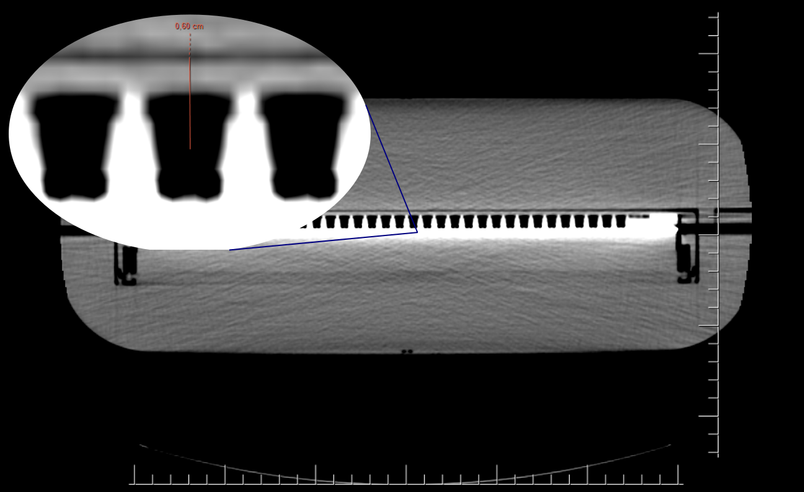
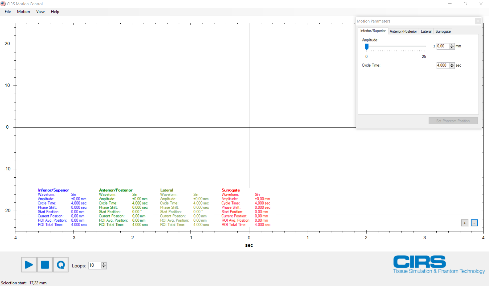

.. _dosimetry_equipment:

Дозиметрическое оборудование
============================

IBA myQA
--------

Полная установка включает ряд стандартных около системных продуктов.
Из существенного:

- MS SQL Server 2016  (полная установка)
- MATLAB Runtime 9.0.

Основная версия отделения устанавливается на компьютере **w66-ecl-08**.

Калибровка матрицы
------------------

Матрица необходима для того, чтобы проверить рассчитанный в ПО Eclipse дозовый план пациента.

Для этого на откалиброванной матрице проводятся измерения дозы на специальном фантоме при аналогичных условиях с целью
получить максимальное отклонение от плана не более 2%.

*Калибровка матрицы:*

.. sidebar:: Калибровочный коэффициент

    Например, матрица
    измеряет 100 отсчетов, и мы знаем, что доза, полученная матрицей, должна составлять 10 Гр, тогда выходной коэффициент равен 10 Гр/100 отсч. = 0,1 Гр/отсч.

Калибровка матрицы заключается в том, чтобы получить для каждой энергии (если необходимо также и для каждой мощности облучения)
калибровочный коэффициент - значение, которое переводит так называемые отсчеты, измеряемые матрицей, в Греи. 

Значения дозы полученные при прохождении пучка (размер поля 10x10см) через водный фантом (SDD = 100 см, SSD = 90 см) являются
референсными при проведении калибровки на матрице. 

*Установка матрицы для калибровки*

1. Конфигурируем стол и матрицу таким образом, чтобы перекрестие лазеров совпало с перекрестием, отмеченным на матрице (см. рис. 7.3.1).

    Первичная установка матрицы

Также следует включить поле и проверить совпадение его размеров с отмеченным на матрице диапазоном 10 x 10 см (см. рис. 7.3.2).

    Проверка размеров поля.

Для воссоздания референсных условий на матрицу нужно осторожно поместить 9.4 см твердой воды(см. рис. 7.3.4). Значение 9.4 выбрано из
следующих соображений:

    КТ-скан MatriXX

Расстояние от поверхности твердой воды до центра ионизационных камер матрицы должно быть равно 10 см. Было проведено КТ-сканирование
матрицы (рис. 7.3.3), откуда видно, что расстояние от поверхности матрицы до центра камеры - 6 мм, следовательно, высота пластин
из твердой воды, которую необходимо поместить сверху - 9.4 см. Также следует отметить, что рефересные измерения были сделаны в жидкой воде,
поэтому для матрицы, где используем твердую воду нужно рефересные значения пересчитать на твердую воду. Для этого ранее были посчитаны 
коэффициенты перехода от жидкой воды к твердой и с помощью линейного преобразования (умножением на коэффициент) можно перейти от значений в жидкой воде к значениям
в твердой воде (рис. 5.2.1).

    Установление твердой воды на матрицу

Далее нужно привести стол на нужную высоту, для этого нужно ориентрироваться по рискам, которые находятся по бокам. В данном случае 
нужно подянть стол так, чтобы горизонтальный лазер нахдился ниже боковой риски на 3-4 мм.(рис. 7.3.5). Таким образом по высоте попадаем
в центр ионизационных камер. Также для проверки нужно посмотреть совпадение по вертикальной риске, находящийся тоже на боковой поверхности матрицы.

    Установление твердой воды на матрицу

В конечном итоге матрица c твердой водой должны выглядить как на рисунке 7.3.6.

    Конечный вид матрицы

*Работа с ПО матрицы*

Для начала калибровки после правильного размещения матрицы и пластин из твердой воды необходимо подключить питание к матрице при
помощи специального провода идущего в комплекте и включить ее кнопкой на задней панели. Далее при помощи кабеля Ethernet необходимо
подключить матрицу к ПК с установленным на нем ПО MyQA. На рабочем столе ПК находим приложение MyQA и кликаем по ярлыку дважды - 
открывается окно для авторизации: вводим имя пользователя и пароль. В верхнем левом углу, если выбрано MyQA Patients кликаем и
выбираем MyQA Platform (рис. 7.3.2).

.. figure:: images/myqa1.png
    :name: _myqa1
    :align: center
    :width: 35%
    :figclass: align-center

    Действия при входе в MyQA

Далее переходим во вкладку *Equipment setup* и в списке устройств выбираем *MatriXX* (рис. 7.3.3). 

    Начало работы с матрицей

В окне *Calibrations* нажимаем кнопку *Edit* и в открывшемся окне *Connect* - устройство запросит набор фона,
нажимаем *Compensate* и ожидаем:

.. figure:: images/myqa3.png
    :name: _myqa3
    :align: center
    :width: 100%
    :figclass: align-center

    Подготовка к калибровке матрицы

После набора фона можно приступать к калибровке. Для проведения калибровки по конкретной энергии для определенного
ускорителя нажимаем *New output calibration*.

    Калибровка матрицы

В поле *1* выбираем ускоритель, на котором мы проводим калибровку
В поле *2* выбираем необходимую энергию.
В поле *3* вводим рефернсное значение дозы для данной энергии.
В полях *4* и *5* вводим актульные значения температуры и давления в бункере ускорителя.
Затем нажимаем на кнопку Measure (кнопка *6*) и пускаем пучок с ускорителя. Если измерение проведено неправильно, 
то можно сбросить его с помощью кнопки Reset (кнопка *7*).
После измерения в поле *8* описываем измерение в следующей форме: "Accelerator Energy".
При калибровке полей без сглаживающего фильтра (FFF) также необходимо указать мощность дозы в МЕ.
В поле *9* указываем отпущенную дозу (100 МЕ). Если необходимо в поле 10 можно оставить комментарии
к проведенному измерению.

BeamChecker
-----------

Референсный план BeamCheckerPlan
~~~~~~~~~~~~~~~~~~~~~~~~~~~~~~~~

Референсный план для утренних проверок показан на рисунке
:numref:`(Рис. %s) <_beamchecker_plan-figure>`.

В Eclipse план идентифицируется по следующим параметрам:

- *Patient ID*: **2370005**
- *Last Name*: **Phantom**
- *First Name*: **BeamChecker**

    План облучения *BeamChecker*, используемый при открытии файла утренних проверок

База данных
~~~~~~~~~~~

Представлена единственным файлом базы данных *MS ACCESS* **Daily_QA.mdb**.
Доступ к ней защищен паролем **7601**.
Базу данных можно переносить с компьютера на компьютер. 
Но это следует делать только в целях просмотра.
Загрузка данных из приора в компьютер должна производиться только с одним компьютером,
с помощью которого производились измерения.

.. note:: Имя референсного компьютера для *BeamChecker* 

     .. code-block:: none

        Hostame: w66-aria-14
        DB: C:\BeamCheckerDB\Daily QA.mdb

Полезные ссылки
~~~~~~~~~~~~~~~

- https://help.imageowl.com/hc/en-us/articles/1500009757421-Connecting-Standard-Imaging-QA-Beam-Checker-Plus-QABC-

Dynamic platform
----------------

Подготовка к работе
~~~~~~~~~~~~~~~~~~~

Для начала работы с *Dynamic platform* необходимо установить софт 
с USB-носителя идущего в комплекте. Вставляем его в ПК, который планируется испльзовать для работы с платформой:

- Из папки USB-to-Network Adapter устанавливаем драйвера для использования переходника USB-Ethernet (В папке находим установщик *Setup.exe* и кликаем два раза);
- Из папки InstallTrioPCMotion_2_12_0 устанавливаем софт TrioPCMotion;
- Из папки MotionControl.Setup_V2.7.7 устанавливаем софт MotionControl (дважды кликаем по *setup.exe*).

Подключаем соответствующие кабеля аппарата к соответствующим гнездам, только потом подключаем питание.
Затем подключаем Ethernet кабель к платформе, а оставшийся конец к переходнику USB-Ethernet и вставляем его в используемый ПК 
в USB-порт :numref:`(Рис. %s) <_usb>`.

    Подключение платформы к используемому компьютеру

Далее действуем по алгоритму указанному на :numref:`рисунке %s <_settings_cirs>`.

    Настройка компьютера для работы с платформой

Работа с программным обеспечением
~~~~~~~~~~~~~~~~~~~~~~~~~~~~~~~~~

При открытии приложения *CIRS motion control* попадаем в следующее рабочее пространство :numref:`(Рис. %s) <_cirs1>`.

    Первый вход в *CIRS motion control*

В окне *Motion parameters* можно вручную изменять амплитуду и периодичность движения (для нашей платформы вкладки *Inferior/superior* - движение вперед-назад
и *Surrogate* - движение маленькой платформы вверх-вниз) - :numref:`рисунок %s <_cirs2>`.

    Подготовка к запуску (1)

Также есть возможность создавать траектории движения в виде функций типа :math:`sin(x)` или :math:`cos^4 (x)` - :numref:`рисунок %s <_cirs3>`.

    Подготовка к запуску (2)
