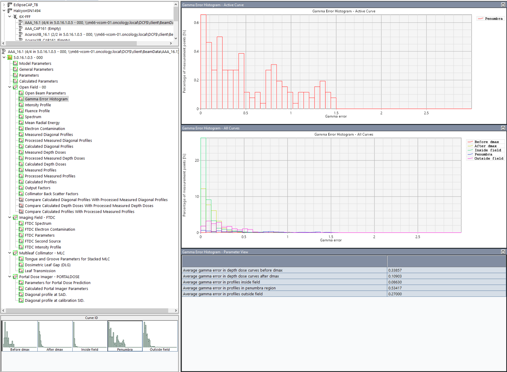
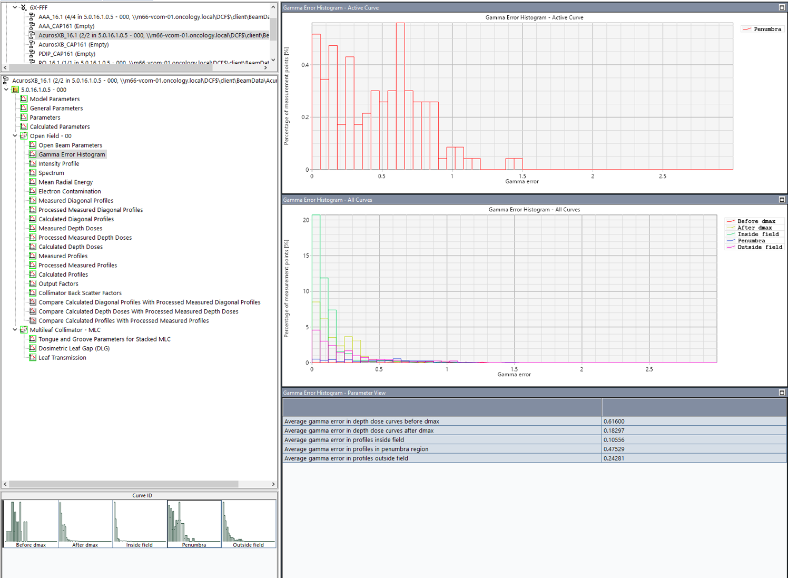
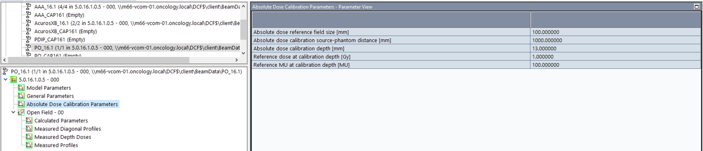
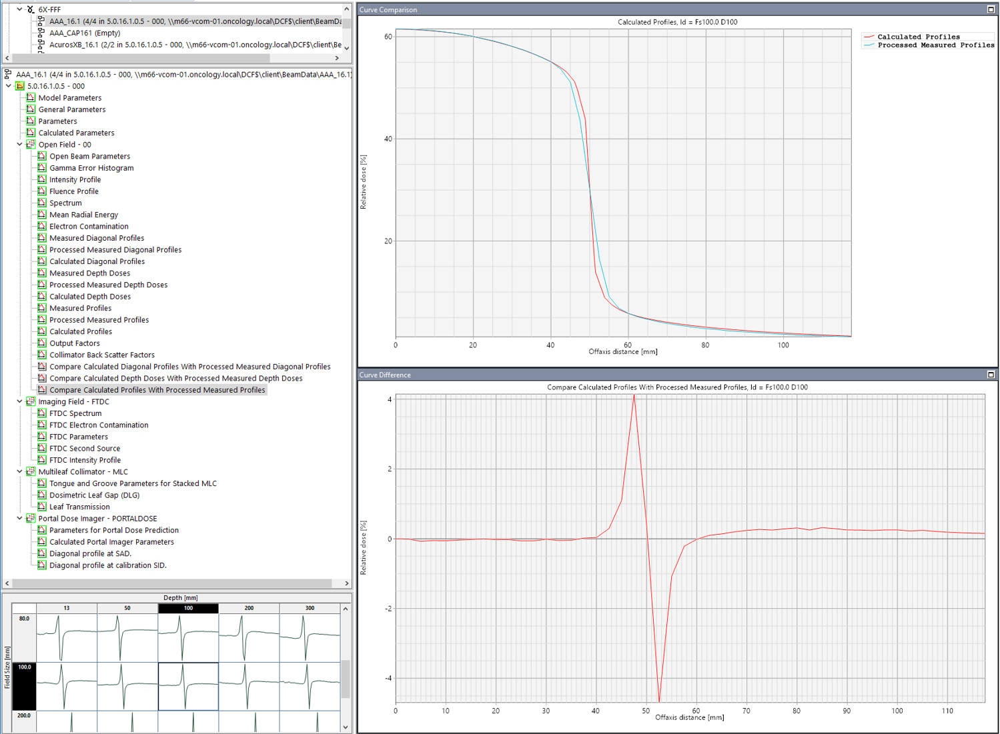
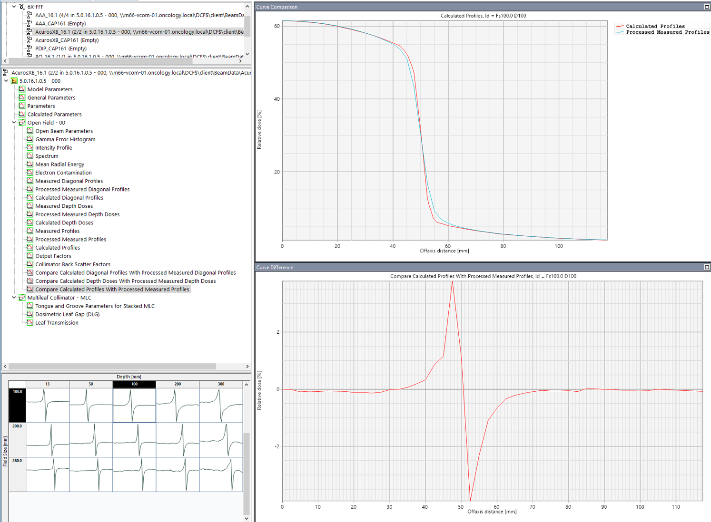

.. _commissioning_halcyon:

Commissioning Halcyon S/N 1494
==============================

При настройке Halcyon использовались настройки, выполненные Varian.
Наше сравнение измеренных нами данных с заложенными в систему планирования
показали их полную идентичность.
Поэтому было принято решения оставить фирменную конфигурацию.
Далее приводятся материалы верификации дозиметрии аппарата. 

Администрирование конфигурации
------------------------------

Настройки аппарата конфигурационного характера доступны из основного мею по команде **System Administration**.

Описание процедур конвигурации содержится в документе 
`Halcyon and Ethos Radiotherapy System. Instructions for Use <./data/varian/Halcyon_and_Ethos_Radiotherapy_System_Instructions_for_Use.pdf>`_
на стр. 31.

Предметом конфигурации являются:

- Политика блокировки стола при лечении.
- Управление пользователями. В нашем случае это делается в *Aria*. Однако есть нюансы в правах доступа.
- Конфигурация автоматического старта по времени.
- Контроль движения пациента по видео изображению.
- Backup конфигурационных файлов. Backup файлы сохраняются в папке **\VMSOS\AppData\TDS\Output**.
- Случайные процедуры конфигурации (сетевые пароли, лицензии, права доступа).

Калибровка по абсолютной дозе
-----------------------------

Процедура калибровки включает не только калибровку по абсолютной дозе,
но и регулировки параметров Ion1/2 и условий работы ионизационных камер.
Поэтому калибровку необходимо производить по инструкции производителя,
содержащейся в документе 
`Halcyon and Ethos Radiotherapy System Instructions for Use <./data/varian/Halcyon_and_Ethos_Radiotherapy_System_Instructions_for_Use.pdf>`_
на странице 138.

.. note:: Смысл и алгоритм дополнительных к калибровке процедур не понятен.
          Нужно разобраться и записать здесь.
          Возможно где-то в литературе встретится или помогут сервисные инженеры Вариан.

Справочные данные
~~~~~~~~~~~~~~~~~

На основании измерений качества излучения и перехода от *РИО* к *РИП/Dmax* 
и сравнения последнего с укорителями *TrueBeam* установлены следующи параметры калибровки,
обеспечивающие на всех ускорителях для энергии **6XFFF** одинаковую дозу на *MU*
в изоцентре на глубине 10 см.

.. code-block:: none

    Beam quality, Q(TPR20,10) = 0.629
    TMR(zref, 10 g/cm^2) = 0.752

Настройки дозиметрии в системе планирования
-------------------------------------------

Глобальные параметры настройки
~~~~~~~~~~~~~~~~~~~~~~~~~~~~~~

На рисунке :numref:`(Рис. %s) <_halcyon_beam_config_AAA>`
представлены данные о конфигурации дозиметрии и результаты гамма-анализа
аппаратна Halcyon для алгоритма **AAA** и на рисунке
:numref:`(Рис. %s) <_halcyon_beam_config_Acuros>`
для алгоритма **AcurosXB**.

    Конфигурации дозиметрии Halcyon и результаты гамма-анализа для алгоритма **AAA**

    Конфигурации дозиметрии Halcyon и результаты гамма-анализа для алгоритма **AcurosXB**

На рисунке :numref:`(Рис. %s) <_halcyon_beam_config_PO>`
для справки и примера конфигурации других аппаратов представлена настройка алгоритма оптимизации (**PO**).

    Конфигурации дозиметрии Halcyon для алгоритма **PO**

Профили
~~~~~~~

    Пример профилей для **AAA**.
    Target spots for AAA: X = 0.0 / Y = 0.0.
    TnG distal = 0.04 / proximal = 0.056.
    DLG = 0.01 / Leaf transmission = 0.0047.

    Пример профилей для **AcurosXB**.
    Target spots for AcurosXB: X = 0.7 / Y = 0.7.
    TnG distal = 0.04 / proximal = 0.056.

