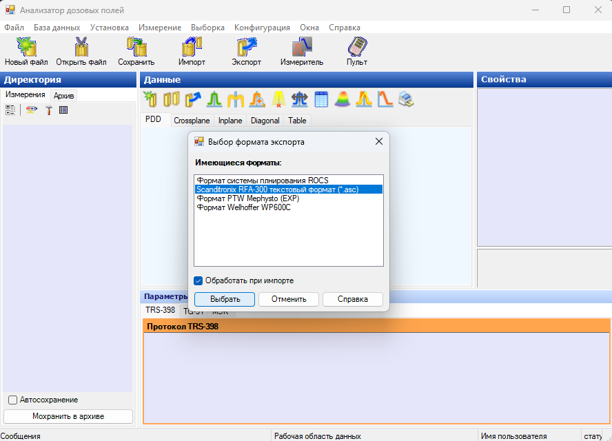
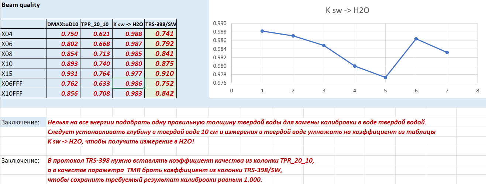

.. _commissioning_truebeam:

Commissioning TrueBeam
=========================

Настройки двух аппаратов **TrueBeam** (*S/N 5118-STX и S/N 5128*) идентичны.
Поэтому рассматриваются в одной главе.
Принципиальная разница в сравнении с *Halcyon* в том, что последний настраивается производителем
и настройка последнего сводится к верификации.

В центре Логинова использовалась постобработка измерений,
направленная на подавление шумов, центрирование профилей 
и заполнение пропущенных полей таблиц факторов выхода.
Поскольку это важная часть всего процесса и может использоваться в будущем повторно,
процедуры далее коротко описаны и проведены ссылки на используемые инструменты.

Подготовка измерений к передаче в систему планирования
------------------------------------------------------

Стандартные средства *IBA* не имеют функциональности борьбы с шумами и автопозиционирования профилей,
в центре *Логинова* применялся собственный программный инструментарий.

Выполняется это следующим образом:

- В программе водяного фантома **myQA Accept** выбираются нужные данные и сохраняются в формат **ASC** 
  (простой текстовый формат сохранения измерений в водяном фантоме *IBA*).
- Сохраненные файлы импортируются в программу **WP** с установленным флагом *Обработать при импорте*.
  При этом нужно следить что именно импортируется, чтобы было дальше удобнее использовать 
  в конфигурации системы планирования *Eclise*.
- Затем, в **WP** экспортировать обратно в **ASC** формат.
- Для контроля за результатами обработки сканов в **WP** импортировать исходный файл **ASC**, 
  но ужн без флага *Обработать при импорте*. В результате WP покажет
  вместе оригинальные сканы и сканы после обработки.
- Экспортированные **WP** обработанные сканы открываются в программе **myQA Accept** и 
  экспортируются в **RTPS** формат системы планирования *Eclipse*.

Коррекция глубины в профилях PDD
~~~~~~~~~~~~~~~~~~~~~~~~~~~~~~~~

Поскольку крайне трудно установить датчик по поверхности точно 
после измерений может возникать необходимость смещения PDD по глубине.
Поскольку проблема связана с позиционированием детекторы,
то смещение всех измеренных PDD средствами ПО водяного фантома
осуществляется одновременно как групповая операция.
Эта операция выполняется в программе **myQA Accept** 
до описанного выше сохранения в *ASC* формате.

Программа сглаживания и центрирования профилей **WP**
~~~~~~~~~~~~~~~~~~~~~~~~~~~~~~~~~~~~~~~~~~~~~~~~~~~~~

Одним из компромиссных вопросов в измерении профилей дозовых распределений 
является выбор между малым размером детектора и возрастающем при этом шуме.
Учитывая, что количество точек в измеряемых профилях существенно больше 
количества самплов в данных, передаваемых в систем планирования, 
возможно и полезно сглаживать измеренные данные.

На рисунке :numref:`(Рис. %s) <_wp_import_smooth-figure>`
представлен вид программы обработки сканов **WP** и форма импорта в режиме импорта с обработкой.

    Вид программы обработки сканов **WP** и форма импорта 
    в режиме импорта с обработкой

При обработке сканов происходит сглаживание высококачественными 
сплайнами под натяжением для устранения шумов.
Затем, в случае профилей, автоматически определяемых как потенциально симметричных,
определятся левая и правая граница. Середина между ними определяется как требуемое смещение.
Таким образом автоматически центрируется их положение.
Затем устраняется ассиметрия путем усреднения значений слева и права.
*Eclipse* делает то же самое, но он предварительно не центрирует профили, 
чем искажает не идеальные данные..

Калиброва ускорителей по абсолютной дозе
----------------------------------------

По абсолютной дозе оба ускорителя калибруются одинаково.
Т.е. применяется одинаковый коэффициент перехода от референсной глубины на РИО
к максимуму ионизации на РИП.

**Калибровку следует осуществлять в твердом фантоме при расположении камеры в изоцентре
и на глубине 10 см до ее центра!**

На рисунке :numref:`(Рис. %s) <_true_beam_absolute_doses-figure>`
представлен набор справочные данные для протокола *TRS-398* по калибровке ускорителей 
*TrueBeam-5128* и *TrueBeamStx-5118* по абсолютной дозе.

    Справочные данные для протокола *TRS-398* по калибровке ускорителей 
    *TrueBeam-5128* и *TrueBeamStx-5118* по абсолютной дозе

Калибровка дозиметрии по абсолютной дозе
~~~~~~~~~~~~~~~~~~~~~~~~~~~~~~~~~~~~~~~~

При калибровке важно помнить следующее:

- Изменить калибровку можно в сервисном режиме только при запуске его в режиме **Intermediate**!
- Единственный вводимый параметр - это доза в *сГр* в максимуме ионизации поля 10 х 10 при *РИП* = 100 см 
  за 100 *МЕ* при текущей калибровке.
- Иными словами, проводится измерение по *TRS-398* на *РИО / depth* = 10 см. 
  Из протокола берется значение в *Dmax* и вводится доза в качестве калибровочной величины.
  Далее команды на калибровку, пересчет ионизации и сохранение.
