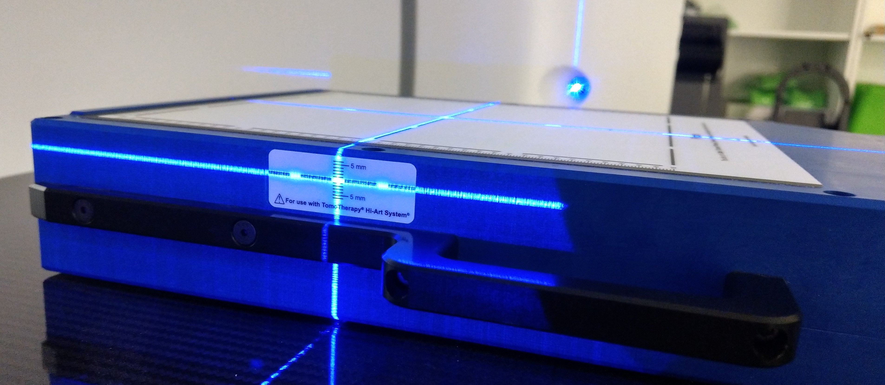

.. _qa_equipment_daily_qa:

Ежедневные процедуры на аппаратах
=================================

Общие правила
-------------

На ускорителях каждое утро выполняются три типа процедур:

- Cтандартная самопроверка аппаратов **MPC**.
- Проверка радиационных параметров излучения с помощью **BeamChecker**.
- Проверка работы навигационных систем.

MPC
~~~

Выполняется согласно описанию ускорителя, т.е. устанавливается фантом как, например,
на рисунке :numref:`(Рис. %s) <_halcyon_position_mpc>` и запускаются команды на старт тестирования.

BeamChecker
~~~~~~~~~~~

В приборе используется понятие *BaseLine*, т.е. некие ожидаемые результаты измерений в зависимости от 
аппарата и энергии излучения. Установка *BaseLine* - это отдельная процедура, в норме проводимая один раз 
при запуске ускорителя в эксплуатацию когда параметры ускорителя зафиксированы.
Все последующие измерения сравниваются с *BaseLine* и в зависимости от величины расхождения прибор
сигнализирует об успехе или ошибке.

Измерения должны производиться в условиях, при которых были заданы *BaseLine*.
Самое существенное - это установка *BeamChecker* по высоте.
Необходимо центрировать по лазерам в метки на боковых стенках как показано на рисунке
:numref:`(Рис. %s) <_beam_checker_positioning>`.

    Установка *BeamChecker* по лазерам

При использовании прибора нужно устанавливать аппарат (номер комнаты, *Room*). 
Энергия излучения определяется прибором автоматически после измерения.
При отсутствии ошибок можно запускать измерения последовательно не производя никаких действий с *BeamChecker*. 
Он самостоятельно определяет границы начала и окончания измерения.

Аппараты в *BeamChecker* распределены по *комнатам* в соответствии с таблицей
:numref:`(Табл. %s) <_rooms-table>`.

.. list-table:: Дозиметрическое оборудование
   :name: _rooms-table
   :widths: 1, 3
   :width: 70%
   :align: center
   :header-rows: 1

   * - ROOM
     - Аппрат
   * - Room1
     - Truebeam Stx 5118
   * - Room2
     - Truebeam 5128
   * - Room3
     - Halcyon 1494

Оригиналы файлов утренних проверок можно загрузить по
`ссылке <./data/files/BeamChecker_plans.zip>`_.

Навигационные системы
~~~~~~~~~~~~~~~~~~~~~

.. todo::
    
  #. Изучить вопрос.
  #. Определиться нужны ли эти тесты несмотря на MPC.
  #. Расписать процедуру.

Действия при непрошедших тестах
~~~~~~~~~~~~~~~~~~~~~~~~~~~~~~~

#. Убедиться, что все установки тестов выполнены правильно. 
   При обнаружении ошибок установки исправить их и повторить тесты.
#. Не допускать аппарат к лечению больных и доложить ответственному медицинскому физику,
   уполномоченному решать вопросы, связанные с безопасностью лечения пациентов.

Политика обработки результатов
~~~~~~~~~~~~~~~~~~~~~~~~~~~~~~

На ускорителях *TrueBeam* проверка энергий производится по недельному графику.
Конкретный график содержится в специальной форме контроля проведения утренних проверок.

Если измерения не попадают в коридор толерантных уровней, то прибор сигнализирует об этом.
Аппарат в таком случае не допускается к лечению до выяснения причин силами экспертов медицинских физиков.
В формах делаются отметки и выполнении процедуры. Результаты измерений сохраняются в приборе.
Их выгрузка в компьютерную базу данных производится один раз в неделю в понедельник утром 
ответственным медицинским физиком.

Ответственный медицинский физик анализирует текущие данные качественно проходя по всем энергиям и наблюдая за тенденциями.
Ежеквартально готовится формальный отчет с обзором состояния и тенденциями в калибровке ускорителей по всем энергиям.

TrueBeam
--------

Утреннее включение и контроль
~~~~~~~~~~~~~~~~~~~~~~~~~~~~~

#. Стартовать процедуру **MPC** на консоли.
#. На аппарате установить в положение **H2** *MPC* фантом.
#. Запустить **MPC**  и дождаться окончания. В случае успеха продолжить дозиметрические тесты.
#. Перейти в режим **Machine QA** и открыть файл плана.
   
   .. code-block:: none
   
       I:/
#. Установить *BeamChecker* в лазерный изоцентр как показано на рисунке
   :numref:`(Рис. %s) <_beam_checker_truebeam>`.

   .. figure:: images/beam_checker_truebeam.jpg
       :name: _beam_checker_truebeam
       :align: center
       :width: 50%
       :figclass: align-center

       Состояние Halcyon перед началом MPC

#. На рисунке :numref:`(Рис. %s) <_beamchecker_tb_console>`
   показан пример окна консоли. Следует обратить внимание на координаты стола.
   При необходимости их следует **Оverride**. 
   Далее нужно облучить только теми полями, тестирование которых запланировано на текущий день.

   .. figure:: images/beamchecker_tb_console.jpg
       :name: _beamchecker_tb_console
       :align: center
       :width: 100%
       :figclass: align-center

       Позиционирование *BeamCheker* на TrueBeam 

Вечернее выключение
~~~~~~~~~~~~~~~~~~~

Halcyon
-------

Утренние проверки
~~~~~~~~~~~~~~~~~

#. Стартовать процедуру **MPC** на консоли.
#. На аппарате установить фантом как на фото :numref:`(Рис. %s) <_halcyon_position_mpc>` 
   и последовательно нажать две загорающиеся синие кнопки и держать пока стол не придет 
   в нужное положение и кнопки не погаснут.

   .. figure:: images/HalcyonPositionMPC.jpg
       :name: _halcyon_position_mpc
       :align: center
       :width: 80%
       :figclass: align-center

       Состояние Halcyon перед началом MPC

#. Дождаться окончания **MPC** и в случае успеха продолжить дозиметрические тесты.
#. Перейти в режим **Machine QA** и открыть файл плана.
   
   .. code-block:: none
   
       I:/

#. Установить *BeamChecker* в лазерный изоцентр  как показано на рисунке 
   :numref:`(Рис. %s) <_halcyon_beamChecker>`.
   и последовательно нажать две загорающиеся синие кнопки и держать пока стол не придет 
   в нужное положение и кнопки не погаснут.

   .. figure:: images/halcyon_beamChecker.jpg
       :name: _halcyon_beamChecker
       :align: center
       :width: 80%
       :figclass: align-center

       Положение BeamChecker в месте облучения после команд позиционирования

#. Отпустить дозу в соответствии с файлом плана. По окончании на правом мониторе должна 
   появиться картинка как на рисунке
   :numref:`(Рис. %s) <_beamChecker_portal_dose>` 
   и результат отработки излучения как на рисунке
   :numref:`(Рис. %s) <_beamChecker_machineQA>`.

   
   .. figure:: images/beamChecker_portal_dose.jpg
       :name: _beamChecker_portal_dose
       :align: center
       :width: 80%
       :figclass: align-center

       Дозовое распределение после облучения BeamChecker по данным портальной системы

   .. figure:: images/beamChecker_machineQA.jpg
       :name: _beamChecker_machineQA
       :align: center
       :width: 80%
       :figclass: align-center

       Состояние консоли после окончания облучения 

