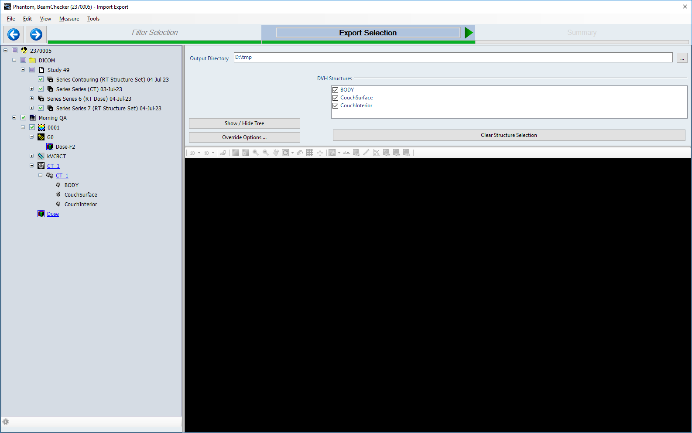

.. _qa_equipment_test_procedures:

Тестовые процедуры
==================

Организация тестовых планов
~~~~~~~~~~~~~~~~~~~~~~~~~~~

Тестирование ускорителей производится в режиме *Physics QA*.
С каждым тестом связан тстовый план в формате *DICOM* имя которого начинается с **RP.**
и расшиерние **.dcm**. 
Это соглашение *Varian* о наименовании файлов, содержащих объект *RTPLAN*.

Подготовка тестовых планов осуществляется в Eclipse точно так же как и планов 
пациентов для верификации. Эти планы экспортируются и данные переносятся в папку ...

Текущие принятые тестовые планы перечислены в таблице ...

С некоторыми планами могут быть сложности из-за неудовлетворения их лечебным планам.
В чстности, на Halcyon не одобряются статические поля с фиксированным коллиматорм.

На рисунке
:numref:`(Рис. %s) <_qa_plan_export_selection-figure>`
показан пример тандартног выбор типов данных для тестового плана.
В нем КТ полезны для логичного отбражения информации на правом мониторе,
которая демонстрируется автоматически.
Все будет выглядеть логично, если изображение плана будет соответствовать используемому фантому.

В Eclipse план идентифицируется по следующим параметрам:

- *Patient ID*: **2370005**
- *Last Name*: **Phantom**
- *First Name*: **BeamChecker**

    Пример тандартног выбор типов данных для тестового плана

и далее ограничивется экспорт ...

MPC - встроенные аппаратные утренние проверки
---------------------------------------------

Объем MPC
~~~~~~~~~

Встроенные проверки (процедура MPC) выполняет следующие контрольные функции ...

Эти функции позволяют исключить следующие тесты ...

Хранение и доступ к результатам MPC
~~~~~~~~~~~~~~~~~~~~~~~~~~~~~~~~~~~

Результаты сохранятся в следующем виде и месте ...

Процедуры анализа результатов MPC
~~~~~~~~~~~~~~~~~~~~~~~~~~~~~~~~~

Полный результат за конкретный день можно посмотреть следующим образом ...

Периодический обзор результатов MPC является частью системы контроля качества.

Процедура обзора содержится в главе :ref:`qa_equipment_review`.

Контроль радиационных полей
---------------------------

Контроль оптических систем
--------------------------

Контроль МЛК
------------

Контроль портальной системы

Контроль навигационных систем
-----------------------------

Контроль системы дыхания
------------------------

Контроль систем безопасности
----------------------------

